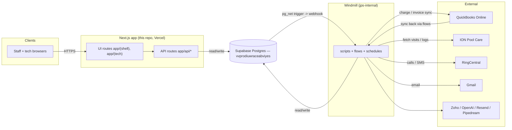

# JPS Internal — System Map

> **Single source of truth** for what exists, where it lives, what it does, and how the pieces connect.
> If you're new (human or AI) — read this first. Then drop into the section relevant to your task.
>
> Last updated: 2026-05-27 by Carter + Claude during the post-loop audit.
> Living document — append, don't replace. Mark sections with `<!-- STATUS: stub -->` when they need fleshing out.

---

## 0. How to use this document

- **Doing a feature?** Find the domain section in §3, scroll its "Files & responsibilities" table, find where the change belongs.
- **Debugging a weird behavior?** Find the table or symptom in §4 (data flows) or §5 (table catalog). The doc shows what reads/writes it.
- **Adding a new table?** Check §6 ("schema ownership rules") before deciding where to put it.
- **Adding a new project/repo?** Append a new top-level section under §8.
- **Hit something unexpected?** Update this doc. Drift between this doc and reality is the bug.

**Conventions used in this doc:** text labels in brackets, per [conventions/LABELS.md](conventions/LABELS.md) — `[write]`, `[read]`, `[r/w]`, `[trigger]`, `[external]` (QBO / RingCentral / Gmail / ...), `[attention]` (needs cleanup or a decision).

---

## 1. Top-level architecture

```
 ┌──────────────────────────────────────────────┐
 │ USERS (browsers) │
 └────────────┬─────────────────────────────────┘
 │
 ┌─────────────────────────────────────────────┐
 │ Next.js app (this repo) │
 │ - UI routes (app/(shell)/, app/(tech)/) │
 │ - API routes (app/api/*) │
 │ - Shared libs (lib/*) │
 └────────────┬─────────────────────────────────┘
 │
 ┌──────────────────────┼──────────────────────┐
 │ │ │

┌─────────────────┐ ┌─────────────────┐ ┌────────────────────┐
│ Supabase PG │─│ Windmill │ │ External APIs: │
│ (vvprodiuwra- │ │ workspace │─│ QBO, RingCentral, │
│ ceabviyes) │─│ jps-internal │ │ OpenAI, Gmail, │
│ │ │ │ │ ION, Zoho, Pipedream│
│ pg_net ────── │ │ scripts + flows│ │ Resend │
│ triggers │ │ + schedules │ └────────────────────┘
└─────────────────┘ └─────────────────┘

 │ (read/write from other repos)
 │
┌───────┴──────────────────┐
│ Other repos (sibling): │
│ • check_buddy │ ← UI + Windmill scripts for QBO check recon
│ • lead-form site │ ← Public website lead intake form
│ • (others — to document)│
└──────────────────────────┘
```

### Container diagram (C4 container level — the stable skeleton)

This is the container-level map a flow doc's Layer 0 ([FLOW_TEMPLATE.md](conventions/FLOW_TEMPLATE.md)) places itself against. The ASCII box above is its text-equivalent fallback (house rule: every Mermaid diagram is paired with text).

The same model at every C4 zoom level (context, containers, components, key flows) is
maintained as a Structurizr workspace: [architecture/workspace.dsl](architecture/workspace.dsl)
— see [architecture/README.md](architecture/README.md) to render it. Same drift rule as this
doc: change reality, change the DSL in the same PR.



**The Supabase project is THE shared resource** — every project reads/writes to it. Code lives in many repos; data lives in one place. That's why schema ownership rules (§6) matter.

---

## 2. The repos / projects | Project | Repo | UI? | Main responsibility | Status | |---|---|---|---|---| | **servicebilling** (this repo) | `/Users/cartergasia/servicebilling/servicebilling` | Yes — internal staff app | Service-billing pipeline, maintenance ops, customer/WO management, ION sync | canonical for owned domains | | **check_buddy** | separate repo | Yes — own UI | QBO check/deposit reconciliation. Writes to `app_checks.*`. Has Windmill scripts at `f/check_buddy/*`. | active but undocumented here | | **lead-form site** | separate repo | Yes — public website | Submit-website-lead flow (calls `public.check_or_create_customer` + `public.create_lead` RPCs) | active but undocumented here | | **(other repos)** | unknown | ? | ? | inventory needed | > **TODO**: add sections for check_buddy and lead-form once we extend the map.

### Supabase projects (separate DBs) | Project | ID | What it is | |---|---|---| | **JPS Internal** | `vvprodiuwraceabviyes` | The main shared DB — everything in this doc references it unless noted | | Route Analysis | `kqtvnltzbqvteawqrovq` | Separate DB, unclear scope | | RD - JPS Call Portal | `xwkpcbasronumppvwftt` | Separate DB, unclear scope | > **TODO**: Document Route Analysis and Call Portal once we extend the map.

---

## 3. Domains in this repo

Each domain is a coherent slice: UI routes + API endpoints + Windmill scripts + database tables that all work together for one business purpose. **When adding a feature, find which domain it belongs to and put files in the right slot.**

### 3.1 Domain: Service Billing

The QBO invoice processing pipeline. Pulls invoices from QBO, enriches them (memos, payment method, classifications), charges cards, sends emails, reconciles payments.

**UI routes** (`app/(shell)/service-billing/`):
- `/queue` — current invoice queue
- `/triage` — invoices needing review
- `/needs-attention` — flagged
- `/past-due` — overdue
- `/awaiting-invoice` — WOs missing invoice number
- `/sent` — completed
- `/activity` — log
- `/audit` — monthly audit reports
- `/revenue` — revenue dashboard
- `/payment-methods` — PM management

**API endpoints** (`app/api/billing/`):
- `bulk-pre-process` — POST kicks off pre-process for many invoices
- `invoices/[id]/apply-credit` — manually apply credit
- `invoices/[id]/charge-balance` — charge card now
- `invoices/[id]/edit` — save edits
- `invoices/[id]/mark-processed`, `mark-ready`, `revert`, `save-and-mark-ready`, `override-credit-review` — status transitions
- `invoices/[id]/preferred-payment-type` — set preferred PM
- `job/[id]` — check Windmill job status
- `pre-process`, `process`, `refresh`, `retry`, `sync`, `sync-all` — pipeline operations

**Windmill scripts** (`f/service_billing/*` — 16 scripts in this repo's domain):
- `dispatch_pre_processing` — every-60s outbox worker
- `pre_process_invoice` — enrich invoice (memo, PM, class)
- `process_work_order` — apply credits, charge card, send email
- `process_invoice`, `push_invoice_edits` — push UI edits back to QBO
- `classify_work_orders`, `classify_work_orders_ai` — WO classification
- `pull_qbo_invoices`, `refresh_open_invoices`, `pull_qbo_credits` — bulk syncs
- `refresh_invoice`, `refresh_payment`, `refresh_customer`, `refresh_credit_memo`, `refresh_customer_credits` — single-entity refreshes (webhook + CDC paths)
- `cdc_reconciler` — every-15min QBO CDC sweep
- `reconcile_payments` — every-5min charge_uncertain resolver
- `apply_credit_manual` — manual credit application
- `pull_customer_payment_methods` — refreshes PM data (called by AFTER INSERT trigger on `billing.invoices`)
- `service_billing_processing`, `distinguished_script` — legacy / chronically failing, candidates for archive

**Database tables**:
- `billing.invoices` — central table. ~2,240 rows. Triggers cascade: indicators (subtotal_ok, credits_ok, payment_method_ok, attempts_ok, enrichment_ok) feed projection trigger → billing_status. **The PM-refresh AFTER INSERT trigger is here** (post-fix).
- `billing.customer_payments` — QBO payment cache, ~16k rows
- `billing.customer_payment_methods` — cards + ACH on file
- `billing.processing_attempts` — audit log of charge attempts
- `billing.payment_invoice_links` — junction (payment → invoice applies)
- `billing.drift_log` — CDC reconciler writes here (60 MB; periodic prune)
- `billing.cdc_cursors` — incremental sync watermarks
- `billing.webhook_expectations` — outbound writes pending QBO webhook
- `billing.webhook_log` — audit of arriving webhooks
- `billing.invoice_send_log` — email send audit
- `billing.reconciliation_findings` — empty, candidate to drop

**Schedules** (Windmill cron):
- `dispatch_pre_processing_60s` — every 60s
- `reconcile_payments_5min` — every 5m
- `cdc_reconciler_15min` — every 15m
- `schedule_pull_credits` — every 30m
- `schedule_pull_invoices`, `schedule_refresh_invoices` — every 4h (offset)
- `schedule_daily_status_check` — daily 6am

**Triggers on billing.invoices** (the indicator/projection pattern):
- `trg_request_pm_refresh_on_invoice_insert` — fires `pull_customer_payment_methods` on truly-new invoices (atomic-claim dedup)
- `trg_bootstrap_indicators_on_invoice_insert` — sets initial indicator values
- `trg_set_subtotal_ok_from_invoice`, `trg_set_payment_method_ok_from_invoice`, `trg_set_credits_ok_from_override` — recompute indicators when source fields change
- `trg_project_billing_status_on_indicator_change` — composes billing_status from indicators
- `trg_auto_promote_to_processed` — moves to 'processed' when paid+sent
- `trg_set_attempts_unblocked_at_on_pm_change` — clears blocked-attempt state on PM change

**External integrations**:
- QBO (Intuit) — invoices, payments, credit memos, charges, deposits
- OpenAI — memo generation in `pre_process_invoice`

**Key data flow**: see §4.1 (Work order → cashed payment).

---

### 3.2 Domain: Maintenance ops

Pool maintenance: scheduled visits, technician routes, chemistry readings, consumables, equipment specs.

**UI routes** (`app/(shell)/maintenance/`):
- `/dashboard` — overview
- `/customers`, `/customers/[id]` — maintenance customer list + detail. The detail page shows each service location's geocode status and lets staff **correct a wrong service address in place** (`edit_service_location_address`), **merge a duplicate** (`merge_service_location`), or **remove** one (`retire_service_location`), and **override the office** (`set_customer_office`). Per ADR 007 §9 the routing/office/visit-location all resolve through the **customer's** confirmed link-table location (`v_customer_primary_location`), not `tasks.service_location_id` (being dropped) — so a corrected/merged address follows through to the map via the customer.
- `/routes`, `/routes/[tech]/[day]` — route view (per-(tech,day) cards → per-route map + stop table)
- `/routes/map` — all-routes territory overview: every active stop on one map colored by office, cross-office outliers flagged (a stop sitting in another office's cluster), + per-route geographic-dispersion table. Reads `public.v_route_stops` / `public.v_route_load`.
- `/techs` — technician list
- `/visits`, `/visits/[id]` — visit history + detail
- `/inventory` — maintenance inventory snapshot

**API endpoints**:
- None directly under `app/api/maintenance/` — maintenance UIs query Supabase directly via `lib/queries/`

**Windmill scripts**:
- ION flows: `f/ION/visits`, `f/ION/work_orders`, `f/ION/consumables_usage`, `f/ION/refresh_stale_work_orders`
- `f/ION/_lib/*` — shared session, parser, normalize, upsert
- `f/ION/_discover/*` — diagnostic probes (consider archiving)
- `f/google_maps/geocode_service_locations` — geocodes the pool address onto `public.service_locations`, validating each result against the SE-GA/NE-FL service bbox (rejects/flags out-of-area geocodes). Source of truth for route geocoding. **A city is required** (ADR 007 §7): a city-less street is flagged `needs_review`, never bounds-bias-guessed to a wrong major-GA city; billing is never used as a geocode hint.
- `f/ION/reconcile_service_addresses` — lands ION's `recurring_tasks` city/state/zip onto `service_locations` (ION is the address authority, ADR 007 §7): fills null cities, and corrects rows whose stored ZIP-region + city both disagree with ION (re-queues geocode). Scheduled; runs before the geocode so street-only rows get a real city first.
- **Office = geography** (ADR 007 §8): `service_locations.office_id` = nearest `branches` row to the pool's rooftop coordinate, set by a trigger (gated on `geocode_status='ok'`). `Customers.office_id` follows the service location; the routing views (`v_routes_summary`, `v_route_stops`) read this geographic branch, not the deprecated `task_schedules.office`. "No office" ⟺ "address unresolved" (the `/maintenance` warning banner).
- `f/google_maps/geocode_customers` [deprecated], `f/google_maps/normalize_customer_addresses` — legacy billing-address geocode onto `public."Customers"`; superseded by `geocode_service_locations` (kept only as a fallback account-level pin, with a bbox guard).

**Database tables**:
- `maintenance.visits` — central. FK → work_orders, employees, service_locations, tasks, task_schedules
- `maintenance.chem_readings` — readings from visits (FK → pools, visits)
- `maintenance.consumables_usage` — chemicals used per visit
- `maintenance.visit_tasks` — per-visit checklist completion (brushing, vacuuming, salt cell clean, etc.). One row per canonical task per visit. Canonical names + alias mapping live in `f/ION/_lib/normalize.py` (TASK_ALIASES + TASK_DEFINITIONS). Added 2026-05-28 to close the gap where this data was being parsed but discarded.
- `maintenance.tasks` — scheduled task definitions per service location
- `maintenance.task_schedules` — routing-only schedule slots (tech, day_of_week, sequence, frequency, office); financial terms live on `maintenance.tasks`, not here
- `maintenance.tasks_audit`, `task_schedules_audit` — change history

**Views (route analysis)** — app-facing, in `public` (PostgREST-exposed, like `v_customer_data_quality`):
- `public.v_route_stops` — routing spine: one row per active slot → pinned `service_location` geocode + tech + customer. `geo_trusted` = coordinate is rooftop-confirmed (`geocode_status='ok'` AND `place_id`); untrusted coords (stale points on never-resolved addresses) are never used for geography. `nearest_office` = closest office by a robust median center over trusted coords; `is_cross_office` = a trusted, office-assigned stop whose nearest office is >8mi closer than its assigned one (cross-office misassignment). `far_from_route` = a trusted stop >25mi from the median center of its own (tech×day) route — the sharpest wrong-address signal (e.g. a Sea Island pool mislabeled to Savannah). Read by `/maintenance/routes/map`.
- `public.v_route_load` — per-(tech, day) rollup over `v_route_stops`: stop count + geographic dispersion (avg/max miles from route centroid).
- `maintenance.service_bodies` — pool body specs per service location
- `maintenance.onboarding` — new-customer onboarding state (populated by `mark_payment_on_file` RPC)
- `maintenance.residential_lead_details` — lead qualifying details
- `public.pools` — pool definitions (FK → service_locations)
- ~~`maintenance.commercial_lead_details`~~ — DROPPED 2026-05-28 (empty, no active code path; recreate if commercial intake comes back)
- ~~`maintenance.truck_check_submissions`~~ — DROPPED 2026-05-28 (truck-check UI route still exists at `app/(tech)/truck-check`; recreate if feature revives)

**Schedules**:
- `f/ION/visits` — every 2h
- `f/ION/work_orders` — every 4h
- `f/ION/consumables_usage` — daily 2:55am ( has_draft, failing daily)

**Triggers**:
- `tasks_updated_at`, `task_schedules_updated_at`, `visits_updated_at` — timestamps
- `tasks_audit_trigger`, `task_schedules_audit_trigger` — write to audit tables
- `trg_sync_lifecycle_from_residential`, `trg_sync_lifecycle_from_commercial` — sync lead lifecycle

**External integrations**:
- ION Pool Care (Fluidra) — ColdFusion-based pool service software, scraped via Chromium
- Google Maps Geocoding API

---

### 3.3 Domain: Customers + Work Orders

The shared "customer record" and "work order" entities used by every other domain.

**UI routes**:
- `/customers`, `/customers/[id]` — main customer detail + sub-tabs: `/billing`, `/invoices`, `/notes`, `/payment-methods`, `/work-orders`
- `/work-orders`, `/work-orders/[id]` — WO list + detail
- `/invoices` — global invoice view
- `/employees` — staff list

**API endpoints**:
- `app/api/customers/[id]/preferred-payment-type`
- `app/api/work-orders/[wo_number]/billable-override`
- `app/api/work-orders/[wo_number]/bonus`
- `app/api/work-orders/[wo_number]/skip`
- `app/api/work-orders/[wo_number]/sync`
- `app/api/work-orders/export`
- `app/api/work-orders/sync-all`

**Windmill scripts**:
- `f/qbo/qbo_customer_sync` — daily QBO customer sync (5am)
- `f/qbo/sync_customer_to_qbo` — push Supabase customer to QBO (called by edge function or trigger)
- `f/service_billing/qbo_customer_write` — Pattern D QBO customer create/update (used at lead intake, leader-correct)
- `f/leads/create_qbo_customer` — legacy conversion-time QBO create (superseded by intake-time Pattern D; manual repair only)
- `f/webhooks/get_employees` — daily Gusto employee sync ( failing)

**Database tables**:
- `public."Customers"` — **THE central customer record**. ~8,876 rows. FK target for tons of tables. `pm_last_checked_at` column used by PM-refresh trigger.
- `public.work_orders` — ~3,179 rows. FK → employees, billing.invoices (via qbo_invoice_id)
- `public.work_orders_history` — change history (28k rows)
- `public.service_locations` — service (pool) addresses per customer; holds the route geocode (`latitude`, `longitude`, `geocoded_at`, `geocode_source`, `geocode_status`). See [service-location.md](entities/service-location.md).
- `public.employees` — staff (FK → branches, departments)
- `public.branches`, `public.departments`, `public.locations` — config/lookup tables
- `public.pools` — pool records per service location

**Triggers**:
- `trg_set_account_type_from_company` (Customers, BEFORE INSERT) — defaults
- `trg_recompute_pm_ok_on_customer_pm_check` — DROPPED today (was orphaned by v2 revert)
- `work_order_history_trigger` — copies to history table on update
- `trg_bootstrap_indicators_on_wo_link` — bootstraps billing indicators when WO links to invoice
- `trg_link_invoice_on_wo_change` — auto-links invoice when WO.invoice_number changes
- `trg_pre_processing_on_link` — fires pre_process when WO links to invoice
- `trg_review_on_wo_completion`, `trg_set_subtotal_ok_from_wo`, `trigger_new_estimate`, `trigger_sync_estimates`

**External integrations**:
- QBO (Customers, Invoices)
- Gusto (employee sync)

---

### 3.4 Domain: Maintenance Billing (Monthly Autopay)

Monthly autopay processing for pool maintenance customers. Distinct from the service-billing pipeline (which handles per-WO invoices).

**UI routes**: integrated into the `/customers/[id]/billing` view; standalone admin tooling lives outside the UI for now.

**API endpoints**: none directly (the flow is Windmill-driven).

**Windmill scripts** (`f/billing/*` — visible in Windmill workspace, NOT mirrored in local repo):
- `f/billing/monthly_autopay` (flow) — runs the monthly cycle
- `f/billing/apply_maint_credits` — apply unapplied maint payments
- `f/billing/send_monthly_invoices` — send via QBO email
- `f/billing/stamp_invoice_memos` — set memo on the month's invoices
- `f/billing/send_decline_email` — notify customers on autopay decline
- `f/billing/sync_invoice_balances` — refresh from QBO
- `f/billing/switch_to_weekly_campaign` — one-off campaign batch send
- `f/billing_audit/compute_chemical_estimates` (monthly), `load_month` — audit reports

**Database tables**:
- `billing.autopay_customers` — roster (replaces old Airtable)
- `billing.autopay_transactions` — one row per customer per billing month; UNIQUE (qbo_customer_id, billing_month) prevents double-charge
- `billing.autopay_events` — immutable event log
- `billing.billing_runs` — master record per monthly cycle
- `billing_audit.maintenance_invoices` — monthly audit table
- `billing_audit.maintenance_invoice_line_items` — line items
- `billing_audit.chemical_cost_estimates` — chemical percentiles
- `billing_audit.consumable_items` — whitelisted SKUs

**Schedules**:
- Monthly autopay is run manually (not on a cron)
- `f/billing_audit/monthly_chem_estimates` — 1st of month, 2am

**External integrations**:
- QBO (charges, payment, email)

---

### 3.5 Domain: Leads + Lead Intake (lifecycle)

New-customer maintenance lead intake from **two** entry points: the public website (external
lead-form repo) and a **new in-app internal form** for office staff. Both hit the same Supabase
RPC pipeline. This repo owns the RPCs + the new `/leads` management UI. The canonical data model
and the dead-code cleanup are specified in [ADR 004](adrs/004-leads-canonical-model.md); the
end-to-end process is [flows/lead-intake-to-conversion/index.md](flows/lead-intake-to-conversion/index.md).

> **Data model = "Gen-2" (normalized).** A type-agnostic envelope `public.leads`
> (`account_id`→`Customers`, `type`, `lifecycle_state`) + a type-specific child
> `maintenance.residential_lead_details` carrying the real `status`
> (`new`→`quoted`→`accepted`→`converted`). The child status is the source of truth; a trigger
> projects it to `leads.lifecycle_state`. There is **no `status` column on `public.leads`**.
> A defunct "Gen-1" flat `maintenance.leads` table was dropped but is still referenced by dead
> code (see [ADR 004](adrs/004-leads-canonical-model.md) for the removal list).

**UI routes** (`app/(shell)/leads/` — new, `/leads` module):
- `/leads` — lead management list (search/sort/paginate, status pills)
- `/leads/[id]` — lead detail: envelope + child + onboarding + activity timeline + actions
- `/leads/new` — internal create form (staff-entered lead → same pipeline as website)

**API endpoints**: server actions in `app/(shell)/leads/actions.ts` (no `app/api/leads`); the
external lead-form site calls the Supabase RPCs directly.

**Windmill scripts**:
- `f/service_billing/qbo_customer_write` — Pattern D QBO customer create, fired at **intake** for new customers (QBO is the leader); reflected by `f/service_billing/refresh_customer`
- `f/comms/quote_followup_cadence` — daily 9am quote follow-up (emails the accept link)
- `f/comms/send_email`, `f/comms/send_sms` — generic senders

**Canonical RPCs** (per [ADR 004](adrs/004-leads-canonical-model.md); `public.*` wrappers delegate to `maintenance.*` impls):
- Intake (live recipe, via `lib/leads/intake.ts` → `POST /api/leads` for both website + internal form): `search_accounts_by_contact`, `create_account`/`update_account_contact`, `create_service_body`, `create_maintenance_lead`; QBO create via `createInQbo`→`f/service_billing/qbo_customer_write`. [attention] legacy/unused-by-intake: `submit_website_lead`, `start_website_lead`+`submit_lead_qualifying`, `check_or_create_customer`, `create_lead`
- Lifecycle: `mark_lead_quoted`, `accept_lead`, `create_card_collection_request`, `get_lead_by_accept_token`, `mark_payment_on_file`, `submit_maintenance_onboarding`
- Read/manage: `get_maintenance_leads`, `get_maintenance_lead_detail`, `get_maintenance_lead_by_id`, `update_maintenance_lead`, `bulk_update_lead_status`, `log_lead_activity`, `add_lead_note`
- [attention] A large set of dead Gen-1 RPCs (`get_leads`, `update_lead_*`, `submit_onboarding`, `add_maintenance_lead_note`, …) are slated for drop — see [ADR 004](adrs/004-leads-canonical-model.md).

**Database tables**:
- `public.leads` — lead envelope (FK → Customers via `account_id`)
- `maintenance.residential_lead_details` — child (status + qualifying); `commercial_lead_details` recreated empty (intake deferred)
- `maintenance.onboarding` — post-conversion onboarding state
- `maintenance.lead_activities` — **recreated** (Gen-2): system events + notes; the UI timeline
- `public.card_collection_requests` — tokenized card-on-file links (shared with service-billing)
- `public.communications`, `email_messages`, `text_messages` — comms (cadence + inbound)
- `public.estimates`, `est_emails` — estimate records + email cache

**Triggers**:
- `trg_sync_lifecycle_from_residential` → `sync_lead_lifecycle_from_child` — child status → `leads.lifecycle_state`
- `trg_pause_campaigns_on_inbound` (on communications) — pauses comms when a customer responds

**External integrations**:
- QBO — customer creation on conversion
- Gmail (`jpsbilling@jeffspoolspa.com`) + RingCentral (SMS) + Resend — quote/accept comms

---

### 3.6 Domain: Card Vault + Card Collection

Customer-facing card-collection flow: customer clicks a link → enters card → it gets vaulted in QBO → marked on lead/customer.

**UI routes**: hosted on the lead-form site or `(auth)/login`-protected; not in `(shell)`.

**API endpoints**: card collection routes likely in the lead-form site repo.

**Database tables**:
- `public.card_vault` — stored cards (FK → Customers)
- `public.card_charge_attempts` — write-ahead log for charges
- `public.card_vault_access_log` — audit
- `public.card_collection_requests` — pending collection tokens

**Triggers**:
- `card_vault_updated_at`, `trg_card_charge_attempts_updated_at`

---

### 3.7 Domain: Inventory + Item Catalog

Item catalog (Zoho), inventory snapshots, sign-outs, transfers.

**UI routes** (`app/(shell)/maintenance/inventory`):
- (sub-pages for counts, sections, sign-outs)

**Windmill scripts** (mostly under `u/carter/` — likely from the original Zoho integration):
- `u/carter/get_purchases` (monumental_script), `get_sales`, `get_adjustments`, `get_vendor_credits`, `get_transfers` — daily Zoho pulls
- `u/carter/take_location_inventory_snapshot`, `get_item_zoho_stock`, `create_adjustment_zoho`, `unapplied_credits`

**Database tables**:
- `public.items` — central item catalog (~6,491 rows)
- `public.qbo_items` — QBO item cache
- `public.consumables_data` — chemicals/consumables
- `public.locations` — branch/warehouse locations
- `public.adjustments`, `public.purchases`, `public.sales`, `public.transfers`, `public.vendor_credits` — Zoho transaction tables
- `public.inventory_movements` — derived (synced from above via triggers)
- `public.inventory_count_events`, `inventory_count_rows`, `inventory_count_sections`, `inventory_count_snapshots`, `inventory_section_items`, `inventory_sections` — counting workflow
- `public.inventory_sign_outs` — tech sign-outs
- `public.spot_check_queue` — empty
- `public.qbo_sales_by_sku` — derived sales rollup
- `public.sku_aliases` — manual SKU mapping
- `public.inventory_starting_zoho`, `public.staging_opening_stock` — one-shot Zoho seed data (archive candidates)

**Triggers**:
- `adjustments_sync_trigger`, `purchases_sync_trigger`, `sales_sync_trigger`, `transfers_sync_trigger`, `sync_vendor_credits` (vendor_credits) — all call `sync_inventory_movements()` which derives the unified `inventory_movements` table
- `item_update` (public.items) — fires a Pipedream webhook (`https://eobvzzab54t50j5.m.pipedream.net`). verify Pipedream flow still exists.

**External integrations**:
- Zoho Inventory
- QBO (items)
- Pipedream (via item_update trigger — purpose unclear)

---

### 3.8 Domain: Tech / Mobile

Tech-facing mobile UIs for in-field use.

**UI routes** (`app/(tech)/`):
- `/tech-login` — tech login (separate auth from internal staff)
- `/truck-check` — truck inspection form
- `/sign-out` — equipment sign-out

**Database tables**:
- `maintenance.truck_check_submissions` — currently empty; truck-check feature may not be in active use
- `public.inventory_sign_outs` (when tech signs out equipment)

---

### 3.9 Domain: Admin + Internal Tools

**UI routes** (`app/(shell)/admin/`):
- `/users`, `/tech-users` — user management
- `/sync-log`, `/sync-issues` — debug views
- `/classification-rules`, `/ion-mapping` — config UIs

**API endpoints**:
- `sync/expectations/recent`, `sync/issues/summary`
- `service/bonuses`, `service/revenue/pivot`

**Database tables**:
- `public.app_config` — app-wide config (1 row)
- `public.app_roles` — role definitions
- `public.qbo_auth_config` — QBO auth state
- `public.qbo_customer_sync_log` — audit
- `public.system_alerts` — alert queue (Windmill sends via Gmail every 5min)
- `public.invoice_processing_log` — legacy processing audit log

---

### 3.10 Domain: Email Extraction (Allied Universal)

Auto-extract data from Allied Universal invoice PDFs received via email.

**Windmill scripts**:
- `f/email_extraction/download_email_pdfs` — Gmail search + download
- `f/email_extraction/extract_invoices` — parse PDFs

**Database tables**:
- `email_extraction.email_attachments`
- `email_extraction.extraction_results`

---

### 3.11 Domain: Comms (RC/SMS/Email)

Shared comms infrastructure used by all domains.

**API endpoints**:
- `app/api/comms/send-email` — wraps `lib/comms/server/resend.ts`
- `app/api/comms/send-sms` — wraps `lib/comms/server/ringcentral.ts`

**Windmill scripts**:
- `f/comms/send_email`, `send_sms` — generic senders
- `f/alerts/send_pending_system_alerts` — every-5min cron sends queued alerts
- `u/carter/rc_lookup_number`, `rc_deep_lookup`, `rc_call_analysis`, `transcribe_call` — RingCentral utilities
- `u/carter/receive_sms` — webhook handler ( currently failing)

**Database tables**:
- `public.communications`
- `public.text_messages` (FK → communications)
- `public.email_messages` (FK → communications)
- `public.voicemail_transcripts`
- `public.system_alerts`
- `public.legacy_twilio_text_messages` — archive candidate

**External integrations**:
- RingCentral (calls, SMS)
- Gmail API (sending via domain-wide delegation)
- Resend (alternative email)

---

## 4. Key data flows

### 4.1 Work order → cashed payment (the central flow)

```
1. ION scrape → public.work_orders created
2. Office staff enters invoice_number on WO in ION
3. Next pull_qbo_invoices run:
 - finds WO with invoice_number but no billing.invoices row
 - fetches invoice from QBO
 - INSERTs into billing.invoices ← AFTER INSERT trigger fires here
 ↓
 pg_net → Windmill →
 pull_customer_payment_methods(only_customer_id)
 ↓
 refreshes billing.customer_payment_methods
4. trg_link_invoice_on_wo_change links WO → invoice
5. trg_pre_processing_on_link fires pre_process_invoice via pg_net
6. pre_process_invoice:
 - applies any matched credits
 - resolves payment_method (on_file vs invoice)
 - picks target_payment_method_id
 - derives qbo_class
 - generates memo via OpenAI
 - writes results to billing.invoices
 - triggers cascade: payment_method_ok recompute → billing_status projection
7. billing_status moves to 'ready_to_process'
8. UI shows invoice in queue → staff clicks Charge
 OR auto-processor picks it up
9. process_work_order:
 - applies credits (idempotent)
 - charges card/ACH via Intuit Payments
 - records QBO Payment (with CCTransId)
 - updates QBO invoice memo + class
 - sends invoice email
 - writes processing_attempts audit row
10. trg_auto_promote_to_processed flips billing_status to 'processed'
```

**Tables touched in order**: work_orders → billing.invoices → billing.customer_payment_methods → billing.invoices (enrichment) → billing.processing_attempts → billing.payment_invoice_links → billing.customer_payments → work_orders (billing_status update).

### 4.2 Lead intake → onboarding → conversion

Full detail: [flows/lead-intake-to-conversion/index.md](flows/lead-intake-to-conversion/index.md). Note the
**two status fields**: the child `residential_lead_details.status` is authoritative; the trigger
projects it onto `leads.lifecycle_state` (open/closed). `public.leads` has no `status` column.

```
1. Intake (two entry points, ONE orchestrator = lib/leads/intake.ts):
   a. Public website (perfectpools-redesign) → POST /api/leads   (target; pre-cutover: website-lead-intake edge fn)
   b. In-app internal form (/leads/new)      → submitLeadIntake (same module)
   The recipe:
     - search_accounts_by_contact: dedup → create_account (new) or update_account_contact (reuse)
     - NEW customer → create in QBO now (Pattern D): createInQbo → f/service_billing/qbo_customer_write,
       stamp Customers.qbo_customer_id, webhook_expectations WAL; refresh_customer webhook confirms (QBO is leader)
     - create_service_body per pool/spa/fountain
     - create_maintenance_lead (computed quote) → public.leads + maintenance.residential_lead_details (status='new')
2. mark_lead_quoted → child status='quoted'; f/comms/quote_followup_cadence emails the accept link (daily)
3. Customer clicks "Get Started Now" → accept_lead (resume-token gated) → child status='accepted'
4. create_card_collection_request → token; customer enters card → mark_payment_on_file
     - INSERT maintenance.onboarding (payment_on_file=true)
     - child status='converted' → trigger sets leads.lifecycle_state='closed' (reason=converted)
5. Customer enters service-billing pipeline from here on (already a QBO customer)
```

### 4.3 Monthly autopay run

```
1. Manual kickoff of f/billing/monthly_autopay (flow)
2. Single QBO token refresh
3. Apply unapplied maint payment credits (f/billing/apply_maint_credits)
4. Fetch roster from billing.autopay_customers
5. Pre-create billing.autopay_transactions rows (UNIQUE constraint guards double-charge)
6. Per customer:
 - find maint invoices for the month
 - charge card/ACH via QBO
 - INSERT billing.customer_payments
 - email receipt
 - update billing.autopay_transactions.status
 - INSERT billing.autopay_events
7. Summary stats written to billing.billing_runs
```

### 4.4 ION visit sync

```
1. Schedule fires f/ION/visits flow every 2h
2. emit_session step (Bun) → logs into Fluidra, captures cookies
3. parse_normalize_test (Python) → fetches service log XLS, parses HTML tables
 - Parser emits per-row dicts with _readings, _tasks, _consumables nested dicts
4. _lib/normalize → maps parser dicts to canonical shape
 - Readings: app_config-driven mapping → maintenance.chem_readings columns
 - Tasks: code-driven alias map (TASK_ALIASES) → visit_tasks_rows
 - Consumables: passthrough → consumables_usage_rows
5. _lib/upsert → writes everything to maintenance.*:
 - UPSERT maintenance.visits (one per service_location + scheduled_date)
 - DELETE-then-INSERT maintenance.chem_readings per visit
 - DELETE-then-INSERT maintenance.consumables_usage per visit
 - DELETE-then-INSERT maintenance.visit_tasks per visit (new 2026-05-28)
6. Links visits to tasks + task_schedules + scheduled_tech_id
```

---

## 5. Schemas in the DB

**Quick read**: which schema owns what, and who's allowed to modify it. | Schema | Owned by | Modify rules | Status | |---|---|---|---| | `public` | servicebilling (this repo) | Migrations in this repo's `supabase/migrations/`. Other repos READ but DON'T modify. | Mixed — many active, many abandoned (see §7) | | `billing` | servicebilling | Same | all active | | `billing_audit` | servicebilling | Same | active | | `maintenance` | servicebilling | Same | active | | `app_checks` | check_buddy (separate repo) | check_buddy's migrations live in check_buddy repo. This repo READS but DOESN'T modify. | active in check_buddy | | `email_extraction` | servicebilling | this repo | active | | `ion` | nobody (abandoned) | DROP CASCADE | to-delete | | `Inventory` | nobody (empty) | DROP | to-delete | For a table-level breakdown of which tables are active vs abandoned, see [`2026-05-27-database.md`](audits/2026-05-27-database.md).

---

## 6. Schema ownership rules

Rules for when in doubt about where new things belong:

1. **One schema, one owning repo.** Tables in `billing.*` only get modified by migrations in this repo. Tables in `app_checks.*` only get modified by migrations in the check_buddy repo. Cross-schema reads via FK are fine.

2. **`public` is the shared layer.** Tables here are the "shared customer/work-order/employee identity" tables that every project might need. Changes here go through THIS repo. Other repos add FKs to these but never alter them.

3. **New project needs its own data?** Create a new schema named after the project. Don't add columns to `public.*` tables. e.g., a tech-time-tracking app would create `time_tracking` schema with its own tables.

4. **Naming**: snake_case for tables and columns; lowercase schema names except the historical `"Customers"` (which we keep capital-C for backward compat — don't add more like this).

5. **Triggers that cross schemas** (e.g., `billing.fn_*` triggers on `public.work_orders`) are fine when documented. The owning schema is the schema of the FUNCTION, not the trigger's table.

---

## 7. Cleanup actions outstanding

Tracked items from [`2026-05-27-database.md`](audits/2026-05-27-database.md). Updated 2026-05-28.

**Done**:
- [x] Drop 27 abandoned empty tables (migration `20260528163527_drop_abandoned_empty_tables.sql`)
- [x] Add `maintenance.visit_tasks` + restore ION visit-task pipeline (migration `20260528163509_add_maintenance_visit_tasks.sql` + normalize.py + upsert.py updates)
- [x] Pull all 122 Windmill scripts into local repo (`wmill sync pull`)
- [x] Build complete script↔table cross-reference matrix ([`2026-05-27-table-script-matrix.md`](audits/2026-05-27-table-script-matrix.md))

**Outstanding**:
- [ ] After next ION ingestion confirms `maintenance.visit_tasks` is being populated: drop `ion.visit_tasks` (and decide on `ion.task_definitions` / `ion.task_aliases` / `ion.reading_definitions` / `ion.reading_aliases`)
- [ ] Drop `Inventory` schema (empty, kept for next round)
- [ ] Decide on the 47 "orphan with data" tables — see §4 of [`audits/2026-05-27-table-script-matrix.md`](audits/2026-05-27-table-script-matrix.md)
- [ ] Pull check_buddy scripts into local repo or document in §8
- [ ] Document the lead-form site (§8 extension)
- [ ] Document Route Analysis + Call Portal Supabase projects (§8 extension)
- [ ] Verify Pipedream trigger on `public.items` is still useful (or drop trigger)
- [ ] Apply `concurrency_key: "qbo_api"` to all QBO-touching Windmill scripts
- [ ] Decide on archive vs keep for `app_checks.qbo_*_cache` (47 MB)
- [ ] Decide on archive for `public.legacy_twilio_text_messages`, `staging_opening_stock`, `inventory_starting_zoho`

---

## 8. Extending the map: other projects

> **Template for new project entries** — copy this block when adding a new repo/project.

### 8.X Project: \<project-name\> <!-- STATUS: stub -->

- **Repo**: \<path or git URL\>
- **Lives at**: \<deployed URL or local-only\>
- **Owner / who knows it best**: \<name\>
- **What it does**: \<one-paragraph summary\>
- **Schemas it owns**: \<list, or "none — read-only consumer of shared schemas"\>
- **Tables it writes**: \<list with brief purpose each\>
- **Tables it reads from shared schemas**: \<list\>
- **Windmill scripts (if any)**: \<folder + brief list\>
- **External integrations**: \<APIs hit\>
- **Connections to OTHER projects**: \<calls / shared data / etc\>

---

### Known projects not yet documented

- **check_buddy** — owns `app_checks.*` schema; writes via `f/check_buddy/*` Windmill scripts (12 scripts visible); has separate UI
- **lead-form site** — calls `public.submit_website_lead` + related RPCs; provides public-facing intake form
- **(other repos)** — to inventory

---

## 9. Glossary

- **Indicator/projection pattern** — on `billing.invoices`, several `*_ok` boolean columns (subtotal_ok, credits_ok, payment_method_ok, attempts_ok, enrichment_ok) are maintained by triggers, and a separate projection trigger composes `billing_status` from them. Decouples writes from status logic.
- **Outbox pattern** — `dispatch_pre_processing` polls a queue every 60s as a backstop for `pg_net` (which is at-most-once and can drop requests under load).
- **OCC guard** — Optimistic Concurrency Control. `INSERT...ON CONFLICT DO UPDATE WHERE existing.qbo_last_updated_time < EXCLUDED.qbo_last_updated_time` prevents two concurrent writers from clobbering each other.
- **CDC reconciler** — Change Data Capture loop. Polls QBO's CDC endpoint every 15min for entities that changed since our last cursor, reconciles drift between cache and QBO.
- **pg_net** — Supabase extension that lets Postgres fire async HTTP requests from trigger functions. Used for fire-and-forget Windmill webhook calls.
- **Concurrency key** — Windmill feature: scripts sharing the same key share a single concurrency budget. Used to rate-limit by external API (e.g., all QBO-touching scripts share `qbo_api` key).
- **windmill_token** — Vault secret in Supabase (`vault.secrets.windmill_token`). The canonical Bearer token for any pg_net trigger that fans out to Windmill. One place to rotate.

---

*This document is the canonical map. If you change reality, update this doc in the same PR.*
