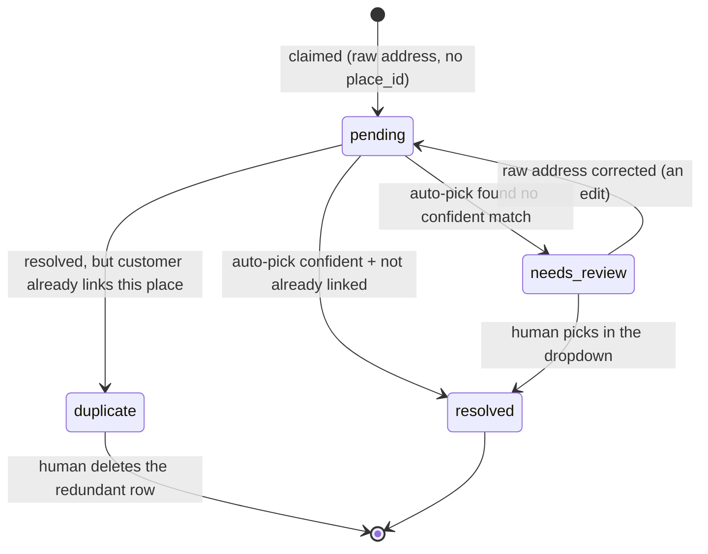

# ADR 007: Address resolution pipeline + the customer↔address ledger

> Status: [accepted] — design agreed 2026-06-19; implementation pending (this is the concrete
> shape of ADR 005 Phase 4 "route all writers through `upsert_service_location`").
> Date: 2026-06-19
> Depends on: [ADR 005](005-canonical-service-address-model.md), [ADR 006](006-ion-customer-id-fuzzy-match-once.md)

## Context

[ADR 005](005-canonical-service-address-model.md) made `service_locations` the canonical service
address (one row per physical place, identity = Google `place_id`) and moved ownership to the
`customer_service_addresses` link table. It also set the resolution method (Autocomplete candidates
+ a pick — a human in the in-app dropdown, or an automated picker for bulk) and said the address
should flow through `upsert_service_location` **at ingestion**. It left three things unspecified:

1. **How do non-form creates get a `place_id`?** The form supplies one (the staff picks from the
   Google Autocomplete dropdown). Every other path — ION ingestion, the nightly QBO sync, the API,
   walk-ins — arrives with a *raw* address string and no `place_id`. Today we assume one exists.
2. **Where do un-resolvable addresses live?** ADR 005 left ~850 customers on `place_id`-NULL
   `service_locations` rows (the rooftop-only cleanup). Holding "we don't know the canonical address
   yet" as a half-formed `service_locations` row pollutes the canonical list.
3. **What enforces the write discipline?** Three writers bypass the model today (the QBO ShipAddr
   sync, ION ingestion, lead intake), each able to blind-`INSERT` a `service_locations` row.

## Decision

Two structural moves.

### 1. `service_locations` is a clean canonical list, written through one door

- **`upsert_service_location` requires a non-null `place_id`** (rejects null) and enforces the
  ADR-005 invariant as a CHECK: `place_id IS NOT NULL ⟺ geocode_status = 'ok'`. It becomes a pure
  "store this *confirmed* place" primitive — it can no longer create a half-row.
- **All writes to `service_locations` go through the customer create/edit path** (the composer
  below). No path blind-INSERTs an address.

### 2. `customer_service_addresses` becomes the address ledger (link + history + resolution queue)

A join row is no longer a minimal tuple; it is the **durable record of "this customer claimed this
address,"** and *resolution* is a property that fills in over time. The row never moves tables.

```
customer_service_addresses
  customer_id              -> Customers
  service_location_id      -> service_locations    NULLABLE (null = not yet resolved)
  raw_street/city/state/zip   the address as entered (provenance + the human's context)
  source                   lead | ion | qbo_ship | qbo_billing_fallback | manual
  resolution_status        pending | resolved | needs_review | duplicate
  is_active                current vs prior owner of the address
  created_at               when the customer first claimed this address (the history axis)
  resolved_at              when service_location_id was set
```

The row's **natural identity is `(customer_id, normalized_raw_address)`** — present from creation,
in every state. `service_location_id`/`place_id` is the resolution that gets written in. This is
why "upgrade in place" works: you find the row by raw address and set the location; you never create
a parallel resolved row. The raw address is normalized with the same `normalize_address` used for
the active-address partial unique, so `"123 Main St"` and `"123 MAIN STREET"` collapse to one row.

#### Row lifecycle



Text fallback:
- **pending** — claimed, no `place_id` yet (untried, or a transient Google failure). The *only*
  state the drain job retries.
- **resolved** — `service_location_id` set; done.
- **needs_review** — Autocomplete ran and found no confident pick → a human resolves it via the
  dropdown (or a corrected raw address resets it to `pending`). Never auto-retried on the same input.
- **duplicate** — it *did* resolve, but to a place the customer already links → the row is left
  unresolved and tagged; a human deletes it. (See constraints.)

### 3. The resolve pipeline (a shared function the composer calls)

`resolveServiceAddress(rawAddress)` is one function with three callers (the composer, the drain job,
the human-pick UI). It runs the ADR-005 "candidates + agreement-guard pick": Places Autocomplete →
pick the prediction whose house-number + corrected street + in-area city all agree → Place Details →
return a `ResolvedAddress { place_id, canonical street/city/state/zip, lat, lng, geocode_status:'ok' }`,
or **none** when nothing agrees confidently (never a guessed `place_id` — the "magnet centroid" trap).

- **Runs around the DB transaction, not inside it** — an external HTTP call must not hold a Postgres
  lock while it waits on Google. The composer resolves, *then* opens the txn to upsert + write the row.
- **Sync-or-defer mode.** Interactive callers (lead form, walk-in) resolve **synchronously** so the
  user sees immediately whether the address pinned. Bulk callers (ION/QBO nightly sync of thousands)
  pass `defer`: insert `pending` rows and let the drain job resolve them in batches (rate-limited) —
  never thousands of inline Google sessions in a request.
- **Google unreachable ≠ no match.** A timeout / 5xx leaves the row `pending` (retry), never blocking
  the create. Only a confident *no-match* is `needs_review`.

### 4. The drain job

A Windmill job (the backstop, like `recover_orphan_tasks`) selects **`service_location_id is null and
resolution_status = 'pending'`** only. It never re-runs `needs_review` (same input → same answer,
wasted spend) or touches `duplicate`. A `needs_review` row gets another attempt only when its input
changes (an edit → reset to `pending`). An optional, explicit "sweep `needs_review`" job can catch
Google improving over time, but that is never the regular drain.

### 5. Constraints

| Constraint | Purpose |
|---|---|
| `unique(customer_id, normalized_raw_address)` | no duplicate *claims* of the same input (e.g. a nightly ION re-sync) |
| `unique(customer_id, service_location_id) where service_location_id is not null` | no duplicate *links* to one place. When resolving a pending row would hit this (two raw spellings → one `place_id`), **the resolve is rejected, the row stays `pending` and is tagged `duplicate`**, and a human deletes it (UI affordance). |
| `unique(service_location_id) where is_active and service_location_id is not null` | the ADR-005 invariant — at most one *active* customer per resolved address (only enforceable post-resolution). |
| **no** per-customer cap | a customer may hold several active service links (commercial / POA with multiple pools/sites). |

### 6. Service-address source priority + billing fallback

Billing and service are **two different addresses**: the *billing* address stays on the QBO/Customer
record; the ledger holds only *service* addresses. Each ingesting caller picks the best raw service
address and stamps `source`:

1. **ION** `ion.recurring_tasks.service_address` — authoritative for maintenance customers (ADR 005).
2. **QBO `ShipAddr`** — the customer's shipping/service address.
3. **QBO `BillAddr`** (fallback) — when `ShipAddr` is empty, use the billing address as the service
   address, stamped `source = qbo_billing_fallback`. For most residential customers billing == service,
   so this is correct and worth resolving automatically; the stamp is what lets a data-quality check
   surface "service inferred from billing — verify" for commercial / property-manager accounts where
   billing ≠ service.

## Consequences

**Good:**
- `service_locations` is a clean canonical list — real `place_id`s only, one write door, no half-rows.
- The full customer↔address history lives in one ledger (`created_at` timeline, `is_active` = current,
  cross-owner history per address) — no separate queue table; the "needs address" list is just
  `service_location_id is null`, with the raw address shown for context, filtered by status into
  "resolve" (needs_review) vs "delete" (duplicate) actions in `/customers/data-quality`.
- Every creation path — form, ION, QBO, API, walk-in — gets identical resolve + dedup + flag
  treatment, with no bypass, because the composer is the single choke point.
- Interactive creates get immediate pinned/needs-a-human feedback; bulk drains in the background.
- A customer is **always** created (billing address is the fallback) — only the service *link* lags
  when the address can't auto-resolve.

**Costs / risks:**
- An interactive create pays a ~200–500 ms Google round-trip; acceptable (the user is waiting and
  wants the result), and the call sits around the transaction, not inside it.
- Making `upsert_service_location` reject null forces every current null-passing writer (form
  free-text fallback, ION ingestion, the nightly QBO `ShipAddr` sync, lead intake) through the
  composer — this is ADR 005 Phase 4 and must be done before the reject-null lands, or those writers
  break. The legacy ~850 `place_id`-NULL rows are grandfathered (forward-only change); they can be
  swept into the ledger as `pending` later.
- Billing-as-service is wrong for commercial / property-manager accounts; the `qbo_billing_fallback`
  stamp is the safeguard (auditable, surfaceable), not a silent conflation.

## Implementation (forward)

1. Migration: `customer_service_addresses` gains `raw_*`, `source`, `resolution_status`, `created_at`,
   `resolved_at`; `service_location_id` made nullable; the three uniques above.
2. `upsert_service_location`: reject null `p_place_id` + the `place_id ⟺ geocode_status='ok'` CHECK.
3. `resolveServiceAddress` (shared) — reuse `f/google_maps/geocode_service_locations.fuzzy_resolve`
   (TS surface: a `/api/places/resolve` route returning the same `ResolvedAddress` as `/api/places/details`).
4. `resolveServiceAddress`-backed composer as the single create/edit front door (`resolve: now|defer`);
   wire **lead intake first** end-to-end (dry-run + verify), then ION ingestion, then the QBO sync.
5. Drain job over `pending`; `v_addresses_needing_resolution` (status-split) feeding `/customers/data-quality`.

## Cross-references

- [ADR 005](005-canonical-service-address-model.md) — canonical address + link table + resolution method
- [ADR 006](006-ion-customer-id-fuzzy-match-once.md) — the per-customer ION↔QBO key (a sibling identity field)
- Operation: [resolve-or-create-customer](../operations/resolve-or-create-customer.md) — the composer's caller contract
- Data quality: `public.v_customer_data_quality` + `/customers/data-quality`
- RPC: `public.upsert_service_location`; resolver: `f/google_maps/geocode_service_locations.py`
