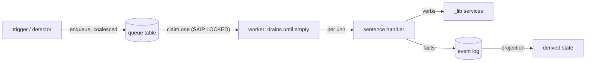

# Workflow execution — queue in, drainer through, events out

> Status: [active]
> The runtime twin of [LIBRARY_COMPOSITION.md](LIBRARY_COMPOSITION.md).
> That doc says what a workflow's CODE looks like (a thin sentence over shared
> services). This doc says how a workflow RUNS when there is more than one unit
> of work: never a batch loop over N items — a coalescing queue, one worker
> that drains it until empty, and a per-unit sentence handler. Applies to any
> workflow; the domain never changes the shape. Built on the patterns decided
> in [ADR 008](../adrs/008-inbox-single-writer-sync.md) §1/§3/§4.

## The model

A workflow (per LIBRARY_COMPOSITION) is one event handled by one sentence.
When the event fires for MANY units at once — month-end makes ~500 invoices
ready in a week, a backfill lands 2,000 work orders — the units do not get a
for-loop. They get:

Text equivalent: a trigger inserts one queue row per unit of work (duplicate
signals coalesce). One worker claims a row at a time and runs the sentence
handler on it, repeating until the queue is empty. The handler composes _lib
services and records FACTS (what happened). All status anyone reads is a
projection over those facts — the handler stamps nothing it could derive.

Each piece, and the rule it enforces:

One structural rule: **one queue table per WORKER** (per drain policy), never
one global table with a script-router — a generic table softens the natural
key that coalescing/claiming/UI reads depend on, and re-implements the job
queue Windmill already is. Every table shares the same envelope columns; the
union view `v_queue_health` (queued / in_flight / dead_letter / oldest per
queue) is the one pane of glass. Priority within a single-action queue encodes
PROVENANCE: interactive clicks enqueue at 1 and jump a backfill flood at 3-4.

| Piece | Shape | Rule it enforces |
|---|---|---|
| Trigger | DB trigger / detector / manual action that INSERTs a queue row | Detection is separated from processing (ADR 008: detectors never do the work) |
| Queue row | An ENVELOPE: unit key, priority, received_at, started_at, finished_at, attempts, error. No payload — the handler resolves state at claim time | Enqueue-time snapshots go stale; claim-time reads cannot (ADR 008 §5) |
| Coalescing | Partial-unique on the unit key `WHERE finished_at IS NULL` + `ON CONFLICT DO NOTHING` | N signals for one unit = one unit of work (ADR 008 §1) |
| Worker | Wake-on-event (`AFTER INSERT` -> pg_net -> Windmill) + heartbeat schedule; `concurrent_limit 1` on the system's write key; claims `FOR UPDATE SKIP LOCKED ORDER BY priority, received_at`; loops until no claimable row | Rate limiting is structural: the leader sees ONE serialized stream no matter how deep the queue gets. Wake gives latency; only the heartbeat guarantees nothing is forgotten (ADR 008 §3) |
| Handler | The workflow's sentence script — an orchestrator over `_lib` services, nothing else | All mechanism (idempotency, fresh reads, retries-with-same-key) lives in the services; the handler is replaceable policy |
| Retry | attempts + 1 on failure, re-claimable until `attempts >= 3`, then dead-letter (stays visible, surfaced in the run summary) | One bad unit never fails a batch; a poison unit cannot loop forever |
| Events | The handler records what happened (attempt rows, verified echoes) — the FACT log | The event log is the source of truth (ADR 009 §E) |
| Derived state | Status/health/progress = views or projections over events + the queue itself | Nothing to drift, nothing to forget to update. The queue rows ARE the progress UI |

## Rate limiting (the two knobs, and which does what)

- **The write serializer** — the worker's Windmill concurrency key
  (`qbo_writer`, limit 1). Money movement and leader writes form a single
  file line. This is the primary knob and it is structural, not configured
  per burst.
- **The read governor** — the per-system token bucket (ADR 008 §4:
  `billing.rate_buckets`, one row per system; `billing.claim_rate_token`
  refills by elapsed time and grants or returns a wait). [active 2026-07-13]
  Implemented ONCE in `f/billing/_lib/qbo`: engines arm it per job
  (`set_rate_limiter(conn)`) and every leader call claims before firing —
  sleep-on-dry, hard-capped wait, then FAIL OPEN (the bucket governs volume,
  never availability). QBO budget: 4/s refill, burst cap 200 (§8 rulebook).
- Demand shedding comes free from the queue: coalescing collapses duplicate
  signals, supersession (`cache newer than signal -> mark done`) drops moot
  work, priority ordering starves analytics before it starves money.

## When a workflow gets a queue (decidable)

- The event can fire for more than a handful of units per trigger
  (month-end, backfill, bulk button) -> **queue**.
- The handler calls a rate-limited external system -> **queue** (the worker
  is where serialization lives).
- Strictly one unit per human action, no external fan-out (a single manual
  retry, a UI detail refresh) -> direct call is fine — of the SAME handler
  the worker uses. One handler, two entry points; the queue is never
  bypassed for bulk.

## Queues ALWAYS self-drain (decided 2026-07-13)

Authorization happens BEFORE enqueue: a queue row means "safe to process".
The control surface is whatever feeds the trigger — gates, the review queue,
human releases — never a manual drain button. Consequently every queue gets
BOTH drain signals, as a pair (never a choice):

- **Wake-on-event** [active]: `AFTER INSERT -> billing.wake_queue_worker()`
  (pg_net POST to the worker's run endpoint, vault `windmill_token`,
  best-effort — an enqueue never fails on a wake failure). Priority-blind:
  any row wakes; priority orders WITHIN the drain. `concurrent_limit 1`
  makes a mid-drain wake queue behind the running drain, closing the exit
  race.
- **Heartbeat is EVIDENCE-DRIVEN, not reflexive** [revised 2026-07-20]: wake
  is primary; a scheduled sweep exists only where evidence (a probe finding
  drops, or v_queue_health.oldest_unprocessed climbing) justifies its cadence.
  A usage audit (2026-07-20) killed the "cheap no-op" assumption: an idle
  scheduled run still costs ~1s of FIXED overhead (worker spin-up + resource
  fetch + DB connect), not ~0 — dispatch_pre_processing at 60s was the single
  biggest consumer (1440 no-op runs/day). So: the 60s pre-process sweep -> 15
  min; the reflexive 15-min charge/inbox heartbeats were REMOVED (drain-until-
  empty + coalescing self-heals a dropped wake on the next enqueue; the qbo
  inbox is swept by cdc_reconciler; balance by the daily integrity probe).
  Only genuine polling-domain sweeps keep a fixed cadence (reconcile_payments
  5m — Intuit has no webhooks; cdc_reconciler 15m — cache-drift catch-all).
  pg_net is at-most-once (~6% drops under burst) — wake gives latency, the
  cadence-matched sweep guarantees nothing is forgotten.

For money queues this means gates-pass = charged: the Ready tab is a monitor
and a priority lever, not a launch pad. Interactive "process now" = enqueue
at priority 1 (under a running drain that beats a direct call, which would
queue behind the WHOLE drain on the concurrency key).

### Wake-trigger safety [added 2026-07-20, after an incident]

A wake trigger is a loaded gun pointed at your execution quota. On 2026-07-20
one misconfigured wake produced 706,682 executions/month — a single runaway,
not distributed load (postmortem: `reference_windmill_execution_incident`).
Three rules, each earned:

- **Enqueue per UNIT, not per ROW; wake off the coalesced insert.** The failure
  was `trg_link_invoice_to_maint_period` — ROW-LEVEL on `billing.invoices`,
  inserting one queue row (and firing one wake) per invoice write. Any bulk
  write (CDC heal, sync, backfill, even dev echo-testing) became a wake flood.
  The charge/inbox queues don't have this: they enqueue on a state TRANSITION
  (`ready_to_process`), one row per unit. If your enqueue is row-level on a
  hot table, it is wrong — move it to the transition, or make the wake
  statement-level so N rows = one wake.
- **After ANY script move/rename, grep every `wake_queue_worker(` path.** A
  Windmill move leaves the old path as `…__MOVED`; a wake hardcoding the old
  clean path spawns jobs that can't resolve their script and fail in 0ms —
  invisible in "success" dashboards, but each still bills as an execution. The
  path string in the trigger is not refactored for you.
- **A wake is best-effort latency, never the guarantee.** pg_net is
  at-most-once (~6% drops under burst). Correctness comes from drain-until-
  empty + coalescing (a dropped wake self-heals on the next enqueue) or an
  evidence-justified sweep — never from the wake landing. So a wake that
  over-fires is a COST bug, not a correctness bug: safe to drop first, diagnose
  second. That is exactly how the incident was stopped (trigger dropped; the
  schedule kept draining).

For the full runaway-failure-mode catalog, the "middleware vs. hardened
chokepoint" decision, and the new-trigger checklist, see
[COMPUTE_GOVERNANCE.md](COMPUTE_GOVERNANCE.md).

## Existing instances

| Stage | Queue | Worker | Handler | Status |
|---|---|---|---|---|
| Maintenance preprocess | `billing_audit.maint_preprocess_queue` (was trigger-fed per-invoice-link — the row-level enqueue behind the 2026-07-20 wake-storm; `trg_wake_maint_preprocess` DROPPED in `stop_maint_preprocess_wake_storm`) | `drain_maint_preprocess_queue` at path `…__MOVED` (15-min schedule only, serial, 3-attempt dead-letter; NO wake) | `preprocess_maint_customer_month` | [drift] wake removed; re-add a per-BATCH (statement-level) wake at the clean path if sub-15-min latency is needed |
| Service preprocess | `billing.service_preprocess_queue` (unit = invoice; `trg_enqueue_service_preprocess` on WO link; migration `20260713190000`; replaced the at-most-once pg_net direct-fire) | `dispatch_pre_processing` (wake + 60s heartbeat + self-heal scan; claim-time eligibility; ONE token refresh per drain) | `pre_process_invoice.process_one` in-process | [active] 2026-07-13 |
| Maintenance charge/send | `billing_audit.maint_charge_queue` (unit = customer-month; `trg_enqueue_maint_charge` on the `ready_to_process` transition; migration `20260710120000`) | `f/billing/process_maint_charges` — self-draining (wake trigger + 15-min heartbeat), drains until empty | inline `process()` sentence: claim-time resolve -> `send_invoice` or `charge_and_record(lines=invoice_ids)`; stamps no status (the projection derives, incl. the delivered-without-charge rule) | [active] 2026-07-10; supersedes `process_maint_period` (kept deployed as manual fallback until verified) |
| Service-billing charge/send | `billing.service_charge_queue` (unit = invoice; `trg_enqueue_service_charge` on the `ready_to_process` transition; migration `20260713150000`) | `process_invoice` itself — self-draining (wake trigger + 15-min heartbeat); live batches enqueue (interactive priority 1); `drain=True` manual kicks; force/orphan recovery stay direct | `process_one` (sentence over `_lib`) | [active] 2026-07-13 |
| QBO sync (the stream loop) | `billing.qbo_inbox` (ADR 008 §1: ONE inbox per SYSTEM, entity_type a column — one drainer/watermark/priority scheme; coalesced per (entity_type, entity_id), NEWEST signal's operation wins so a Void can't be masked; migration `20260713210000`) | `f/service_billing/drain_qbo_inbox` (wake + 15-min heartbeat [pending]; `qbo_api` 1/10; Invoice supersession = cache fresher than signal -> moot at zero API cost; NOT in f/qbo — that folder gets an empty module for f.billing._lib.qbo, see WINDMILL_DEPLOY footguns) | `reflect()` dispatches to the per-entity single-writer refresh handlers in-process ([pending]: handlers still self-manage token/conn — their `_lib` collapse makes it one refresh per drain) | [active] 2026-07-14; webhook route flipped to persist-envelope-return-200 (takes effect on next Vercel deploy) |

## Definition of done (for converting a workflow)

- The trigger only INSERTs; the worker only claims/loops; the handler only
  orchestrates services; the services own all mechanism.
- Killing the worker mid-run loses nothing: unfinished rows re-claim, the
  services' idempotency (persisted keys, WAL-before-charge) makes re-running
  a unit safe.
- Enqueueing the same unit twice produces one unit of work.
- Progress, outcomes, and health are readable from the queue + event log
  alone — the handler stamps no derivable status.
- A 500-unit burst changes queue depth and nothing else.

## See also

- [ADR 008](../adrs/008-inbox-single-writer-sync.md) — inbox/coalescing/
  drainer/token-bucket decisions this generalizes
- [LIBRARY_COMPOSITION.md](LIBRARY_COMPOSITION.md) — the code shape of the
  handler this doc schedules
- [ADR 009](../adrs/009-shared-qbo-primitives-lib.md) — the services the
  handlers orchestrate; §E is the events-not-stamps contract
- [scripts/billing/drain_maint_preprocess_queue.md](../scripts/billing/drain_maint_preprocess_queue.md)
  — the built reference implementation
