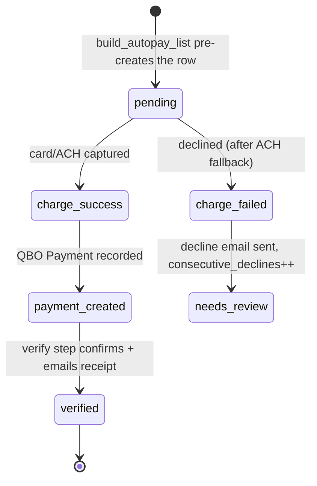

# Entity: Autopay Transaction

> Lives in: `billing.autopay_transactions` (+ `billing.autopay_events` log)
> Source: [native]   (we own it; no external leader)
> Status: [active]

## What it is

The per-customer, per-month record of a monthly autopay charge — the maintenance counterpart to the per-WO [Processing Attempt](processing-attempt.md). One row per `(qbo_customer_id, billing_month)`, with a UNIQUE constraint that makes the billing run idempotent (a re-run finds the existing row and skips terminal statuses instead of double-charging).

Tracks the whole charge lifecycle: amount (`maint_amount`, `outstanding_amount`), `charge_status`, `charge_id`, `qbo_payment_id`, the swept `qbo_invoice_ids`, email state (`receipt_emailed`, `decline_email_sent`), and `verified`. `billing.autopay_events` is the append-only event log of status transitions. Carries an `airtable_record_id` from the pre-Supabase Airtable version.

## Lifecycle

## Transitions — who writes what

| From | To | Caused by | What changes |
|---|---|---|---|
| (none) | `pending` | build_autopay_list (flow step c) | row pre-created with amounts |
| `pending` | `charge_success` / `charge_failed` | charge step (d) | `charge_status`, `charge_id`, `charged_at` |
| `charge_success` | `payment_created` | record QBO Payment | `qbo_payment_id` |
| `payment_created` | `verified` | verify + email (step f) | `verified`, `receipt_emailed` |

## Connected entities

- [Autopay Customer](autopay-customer.md) — the roster row (`payment_method`, `payment_status`, `consecutive_declines`)
- [Maintenance Invoice](maintenance-invoice.md) — the invoice(s) swept (`qbo_invoice_ids`)
- `billing.billing_runs` — the run this transaction belongs to (`billing_run_id`)

## Flows this entity participates in

- [monthly-maintenance-billing](../flows/monthly-maintenance-billing.md) — the charge record + idempotency guard
