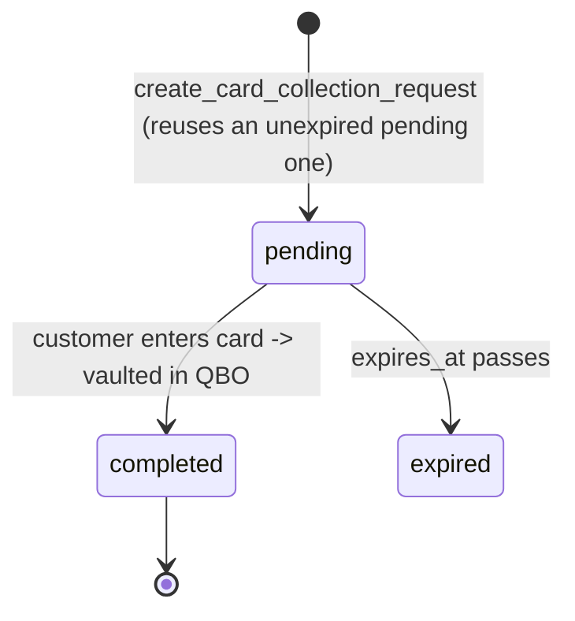

# Entity: Card Collection Request

> Lives in: `public.card_collection_requests`
> Status: [active]
> 53 rows (as of 2026-06-03) — shared between Leads and Service Billing

## What it is

A tokenized "enter your card" link sent to a customer. The customer opens the link, enters a
card, and it gets vaulted in QBO; the request flips to `completed`. Used by **two** domains: the
[Lead](lead.md) pipeline (collect a card to convert a quoted lead — `create_card_collection_request`
→ `mark_payment_on_file`) and Service Billing (ad-hoc invoice card capture, optionally charging
now). Keyed to the customer (`customer_id`), not the lead, so the same request serves whatever the
customer most recently needs.

## Field dictionary

| Field | Type | Describes | Values / constraints |
|---|---|---|---|
| `id` | uuid | Request identity | PK, default `gen_random_uuid()` |
| `customer_id` | bigint | Who the link is for | NOT NULL; FK → [Customer](customer.md) `.id` |
| `token` | text | Opaque link token (`encode(gen_random_bytes(16),'hex')`) | NOT NULL; the public URL key |
| `status` | text | Lifecycle | `pending` \| `completed` \| `expired`; default `pending` |
| `pre_auth_amount` | integer | Optional pre-authorization amount (cents) | nullable |
| `charge_now` | boolean | Service-billing: charge immediately on capture vs vault-only | default `false` |
| `qbo_invoice_ids` | text[] | Service-billing: invoices this collection pays | nullable |
| `invoice_summary` | jsonb | Service-billing: snapshot shown on the page | nullable |
| `memo` | text | Optional note shown to the customer | nullable |
| `created_by` | uuid | Staff member who created it | nullable |
| `created_at` | timestamptz | Created | default `now()` |
| `expires_at` | timestamptz | Link expiry | default `now()+48h`; **lead flow sets 14 days** |
| `completed_at` | timestamptz | When the card landed | null until `completed` |

## Lifecycle

| From | To | Caused by | What changes |
|---|---|---|---|
| (none) | `pending` | `create_card_collection_request` | inserts (or returns the existing unexpired pending row for the account) |
| `pending` | `completed` | card-collection page submit | `status='completed'`, `completed_at`; for leads, drives `mark_payment_on_file` → conversion |
| `pending` | `expired` | time | `status='expired'` |

## Connected entities

- [`Customer`](customer.md) via `customer_id`.
- [`Lead`](lead.md) — resolved via the customer's most recent lead (`get_lead_by_accept_token`).

## Flows this entity participates in

- [lead-intake-to-conversion](../flows/lead-intake-to-conversion/index.md) — card-on-file is the conversion gate.

## Open questions / known gaps

- Shared ownership (Leads + Service Billing) means schema changes here ripple into both — coordinate.
