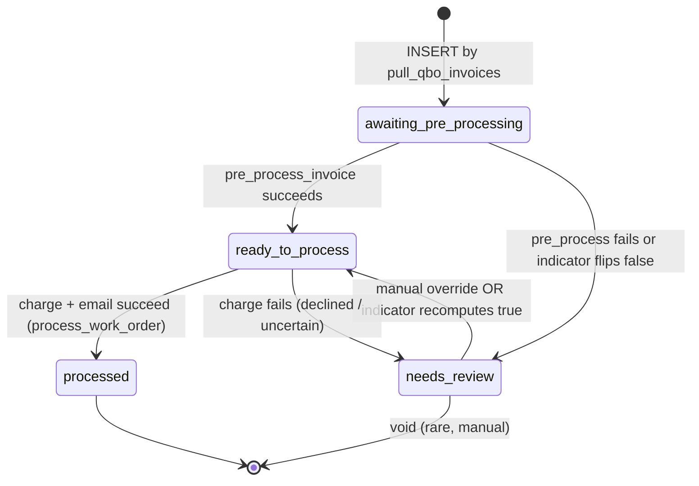

# Entity: Invoice

> Lives in: `billing.invoices` (work-order-linked) + `billing_audit.maintenance_invoices` (task-linked) — unification target below
> Source: [cache: QBO + native]   (QBO owns financial state; we own the link/routing, billing_status + indicators, derived analytics)
> Status: [active]
> 2,250 rows in billing.invoices (1,665 WO-linked, 585 not), 8,302 maintenance

## What it is

One QuickBooks Online invoice, mirrored into our cache. **One universal QBO→invoice sync** brings in *every* QBO invoice as a separate process — it does not classify or pull per-pipeline. The processing workflow is then decided by **what the invoice links to**, not by a type set up front:

- **Work-order-linked** (`work_orders.qbo_invoice_id`) -> [work-order-to-payment](../flows/work-order-to-payment/index.md). A WO can itself be **department=maintenance** (there are maintenance work orders), so a WO-linked invoice can still be "maintenance" for reporting — but it still runs the WO workflow.
- **Task-linked** (via its [Task Billing Period](task-billing-period.md), 1:1) -> [monthly-maintenance-billing](../flows/monthly-maintenance-billing.md). ION issues one per task per month; a customer with N tasks gets N invoices (monthly total = the SUM). Maintenance-specific analytics: [maintenance-invoice detail](maintenance-invoice.md).

**Linkage routes the workflow** — a derived `type`/`link_kind` (`work_order` | `task`) is materialized from the link for indexing and trigger-guarding, but the link is the source of truth. **Coverage guarantee: every QBO invoice should resolve to a work order or a task.** One linked to neither is an **orphan** to investigate (this generalizes "did every maintenance customer get invoiced?" to all invoices). Everything downstream — charging, payments, QBO reflection — is shared; only the path to "ready to charge" differs by link.

**Origin (two leaders at different stages):** The invoice is NOT born in QBO. It is created in **ION** (a closed work order, or the month's visits for a task), which **assigns the `invoice_number`** and owns the line items. It then goes through an **ION-to-QBO syncing queue** (manual push); it appears in **QBO with the same number**, and from that point QBO is the leader for its financial state (balance, email_status, payments).

The `subtotal_ok` indicator (below) catches line items lost during that ION-to-QBO sync — for task-linked invoices the equivalent is SUM(billable visits) vs labor subtotal + the per-item consumable-quantity check (see [monthly-maintenance-billing](../flows/monthly-maintenance-billing.md)).

> **Unification (decided — [ADR 003](../adrs/003-unify-invoice-table.md)):** today the same invoice can sit in two physical tables (`billing.invoices`, `billing_audit.maintenance_invoices`) — that's the 558 duplicates. The decision is **one `billing.invoices` table, routed by a derived `link_kind`** (`work_order` | `task`). Phased: guard the 8 service triggers to `link_kind='work_order'` and add the maintenance columns (incl. `billing_month`, `balance_due`) first; dedupe the 558; then fold maintenance in and **refactor the autopay flow onto the unified table** (proven by a behavioral-equivalence `dry_run` — same customers, same amounts), ending in a clean documented workflow. See [ADR 003](../adrs/003-unify-invoice-table.md).

## Lifecycle (work-order-linked)

The `billing_status` state machine below is the **work-order-linked** path. The **task-linked** lifecycle (load -> link visits -> reconcile -> autopay) is in [monthly-maintenance-billing](../flows/monthly-maintenance-billing.md).



## Transitions — who writes what

| From | To | Caused by | What changes |
|---|---|---|---|
| (none) | `awaiting_pre_processing` | [pull_qbo_invoices](../scripts/service_billing/pull_qbo_invoices.md) (every 4h) — first INSERT | All canonical fields populated; indicators bootstrapped |
| `awaiting_pre_processing` | `ready_to_process` | [pre_process_invoice](../scripts/service_billing/pre_process_invoice.md) sets `enrichment_ok=true` + all indicators true | `memo`, `payment_method`, `qbo_class`, `enrichment_ok` |
| any | `needs_review` | Any indicator flips false (see "Indicators" below) | `needs_review_reason` set to which indicator failed |
| `ready_to_process` | `processed` | [process_work_order](../scripts/service_billing/process_work_order.md) succeeds + auto-promote trigger | `balance=0`, `email_status='EmailSent'` → trigger sets `billing_status='processed'` |

## Indicators (the projection pattern)

`billing_status` is **computed** from five indicator columns. Each indicator is maintained by its own trigger. Writing to a source field (e.g., subtotal) updates the indicator; the indicator update fires the projection trigger; the projection sets `billing_status`.

| Indicator | Set by | True when |
|---|---|---|
| `subtotal_ok` | [trigger](../scripts/_triggers/set_subtotal_ok.md) on UPDATE OF subtotal | WO subtotal matches invoice subtotal within $0.02 |
| `credits_ok` | [trigger](../scripts/_triggers/set_credits_ok.md) on `customer_payments` change | No unallocated credits flagged |
| `payment_method_ok` | [trigger](../scripts/_triggers/set_payment_method_ok.md) on PM change | A billable PM is resolved |
| `attempts_ok` | [trigger](../scripts/_triggers/set_attempts_ok.md) on `processing_attempts` status | No blocking failed attempt |
| `enrichment_ok` | [pre_process_invoice](../scripts/service_billing/pre_process_invoice.md) writes the column directly | Memo, QBO class, PM all resolved |

## Connected entities

- Each invoice has a `qbo_customer_id` → [Customer](customer.md)
- **work-order-linked**: to one [Work Order](work-order.md) via `public.work_orders.qbo_invoice_id` (the WO may be department=maintenance)
- **task-linked**: 1:1 to a [Task Billing Period](task-billing-period.md) (the task-month invoice promise); the task's billable [Visits](visit.md) accrue to that period; coverage tracked via active [Tasks](task.md)
- **neither**: an orphan invoice — flagged for investigation (coverage exception)
- Charges land in [Payments](payment.md) (`billing.customer_payments`), linked via [payment_invoice_links](payment-link.md)
- Credit memo applies land in `customer_payments` rows with `type='credit_memo'`

## Flows this entity participates in

- [Work-order to payment](../flows/work-order-to-payment/index.md) — work-order-linked path
- [Monthly maintenance billing](../flows/monthly-maintenance-billing.md) — task-linked path (visit link + reconciliation)
- [CDC reconciliation](../flows/cdc-reconciliation.md) — backstop for missing QBO webhooks (work-order-linked cache only)

## Common queries

```sql
-- All invoices in the active queue
SELECT * FROM billing.invoices
 WHERE billing_status = 'ready_to_process';

-- Invoices with a specific failing indicator
SELECT qbo_invoice_id, doc_number, needs_review_reason
  FROM billing.invoices
 WHERE billing_status = 'needs_review';
```
