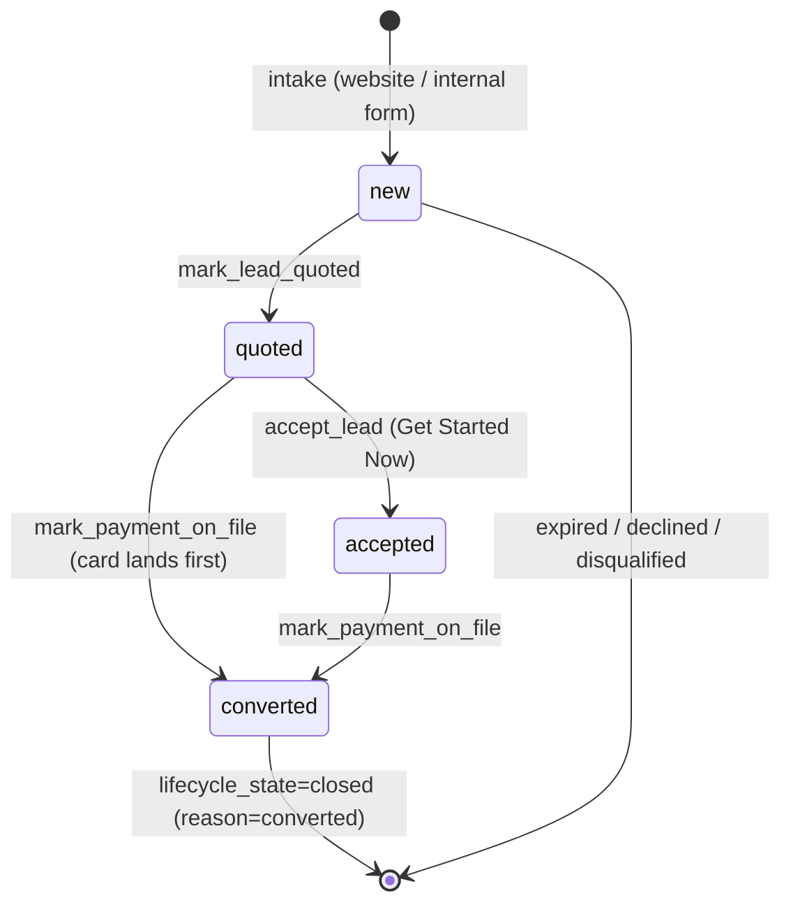

# Entity: Lead

> Lives in: `public.leads` (envelope) + `maintenance.residential_lead_details` / `maintenance.commercial_lead_details` (child)
> Status: [active]
> 12 rows (as of 2026-06-03) — all `residential_maintenance`, all `lifecycle_state='open'`

## What it is

A prospective customer's request for service, from first contact through to conversion (card
on file) or close. A row is created at intake — by the public website or the in-app internal
form — and is **never deleted in normal operation**; it reaches a terminal child status
(`converted`/`expired`/`declined`/`disqualified`) which closes the envelope.

It is **two rows, one entity**: a type-agnostic envelope in `public.leads` and a type-specific
child (`residential_lead_details` or `commercial_lead_details`). The customer identity itself
lives in [`public."Customers"`](customer.md) — a Lead always points at a Customer
(`account_id`), created or deduped at intake. See [ADR 004](../adrs/004-leads-canonical-model.md)
for why this normalized "Gen-2" model is canonical and what dead "Gen-1" flat-table code it replaces.

## Field dictionary

### `public.leads` (the envelope)

| Field | Type | Describes | Values / constraints |
|---|---|---|---|
| `id` | uuid | Lead identity | PK, default `gen_random_uuid()` |
| `account_id` | bigint | The customer this lead belongs to | NOT NULL; FK → [Customer](customer.md) `.id` |
| `type` | text | What kind of lead this is | `residential_maintenance` \| `commercial_maintenance` \| `service_request` |
| `source` | text | Where the lead came from | `website` \| `phone` \| `referral` \| `internal` \| `google` \| `nextdoor` \| `social_media` |
| `office` | text | Branch that owns it | `richmond_hill` \| `brunswick` \| `st_marys` |
| `lifecycle_state` | text | Open/closed — a **projection** of the child `status`, trigger-maintained | `open` \| `closed`; default `open` |
| `closed_at` | timestamptz | When the envelope closed | null until closed |
| `closed_reason` | text | Why it closed | terminal child status, or `ticketed` for service requests |
| `quote_channel` | text | How the quote was sent | `email` \| `sms` |
| `referral_source` | text | Free-text referrer | nullable |
| `contact_attempts` | integer | Follow-up attempts so far | default `0` |
| `last_contacted_at` | timestamptz | Last outreach | nullable |
| `resume_token` | text | 14-day token for the website resume + accept links | nullable |
| `resume_token_expires_at` | timestamptz | Token expiry | nullable |
| `site_visit_required` | boolean | Commercial: needs a site visit | null for residential |
| `site_visit_date` / `site_visit_completed` | date / boolean | Site-visit scheduling | nullable |
| `converted_at` | timestamptz | When the lead converted | nullable |
| `notes` | jsonb | Legacy note array — **deprecated**, superseded by `maintenance.lead_activities` | default `'[]'` |
| `metadata` | jsonb | Free-form intake payload (service-request detail, `entered_via`, …) | default `'{}'` |
| `created_at` / `updated_at` | timestamptz | Timestamps | `updated_at` via trigger |

### `maintenance.residential_lead_details` (child, 1:1 via `lead_id`)

| Field | Type | Describes | Values / constraints |
|---|---|---|---|
| `lead_id` | uuid | The lead this details | PK; FK → `leads.id` ON DELETE CASCADE |
| `status` | text | **The real lead status** (source of truth; projects to `lifecycle_state`) | `new` → `quoted` → `accepted` → `converted`, plus `expired` \| `declined` \| `disqualified` |
| `visits_per_week` | numeric | Service cadence | `0.5` \| `1` \| `2` |
| `quoted_per_visit` | numeric | Quoted price per visit ($) | nullable |
| `first_months_deposit` | numeric | First-month deposit ($) | nullable |
| `pool_condition` | text | Pool state at quote | `good` \| `needs_repair` \| `green_pool` |
| `issue_description` | text | What's wrong / why they called | nullable |
| `lead_context` | text | Extra qualifying context | nullable |
| `contact_preference` | text | How the customer wants to be contacted | nullable |
| `created_at` / `updated_at` | timestamptz | Timestamps | |

### `maintenance.commercial_lead_details` (child, 1:1 via `lead_id`; intake UI deferred)

| Field | Type | Describes | Values / constraints |
|---|---|---|---|
| `lead_id` | uuid | The lead this details | PK; FK → `leads.id` ON DELETE CASCADE |
| `status` | text | Commercial lead status | `new` → `quoted` → `accepted` → `converted`, plus `expired` \| `declined` |
| `company_name` | text | Business name | |
| `closes_for_winter` | boolean | Seasonal close | |
| `summer_frequency` / `winter_frequency` | integer | Visits per week, per season | |
| `property_manager_name` / `_phone` / `_email` | text | Property-manager contact | |
| `commercial_description` | text | Free-text scope | |
| `created_at` / `updated_at` | timestamptz | Timestamps | |

## The two status fields (read this first)

| Field | Lives on | Values | Who sets it |
|---|---|---|---|
| **`status`** (the real one) | child `*_lead_details` | `new` → `quoted` → `accepted` → `converted` (+ `expired`/`declined`/`disqualified`) | the lifecycle RPCs |
| **`lifecycle_state`** (a projection) | `public.leads` | `open` / `closed` | trigger, from child `status` |

The child `status` is the source of truth. Trigger `trg_sync_lifecycle_from_residential` →
`maintenance.sync_lead_lifecycle_from_child()` projects it down to the envelope: a **terminal**
child status sets `lifecycle_state='closed'` (+ `closed_reason`); any non-terminal status
re-opens it. Never write `lifecycle_state` directly, and note there is **no `status` column on
`public.leads`** (a common Gen-1 mistake — `submit_maintenance_onboarding` still has this bug,
see Open questions).

## Lifecycle



A `service_request`-type lead is the exception: `create_lead` opens it already `closed`
(`closed_reason='ticketed'`) with no child status — it is a one-shot ticket, not a pipeline.

## Transitions — who writes what

| From | To | Caused by | What changes |
|---|---|---|---|
| (none) | `new` | `submit_website_lead` / `start_website_lead`+`submit_lead_qualifying` / internal form | inserts `leads` + child `*_lead_details (status='new')`; dedups/creates `Customers` |
| `new` | `quoted` | [`mark_lead_quoted`](../flows/lead-intake-to-conversion/index.md) | child `status='quoted'`; `leads.quote_channel`, `last_contacted_at` |
| `quoted` | `accepted` | `accept_lead` (resume-token gated) | child `status='accepted'` |
| `quoted`/`accepted` | `converted` | `mark_payment_on_file` | child `status='converted'`; upserts [`onboarding`](onboarding.md) `payment_on_file=true` |
| any non-terminal | `closed` | trigger `sync_lead_lifecycle_from_child` | `leads.lifecycle_state='closed'`, `closed_at`, `closed_reason` |
| (at intake, new customer) | — | Pattern D `createInQbo('customer')` | creates the customer in QBO, stamps [`Customers`](customer.md)`.qbo_customer_id` (QBO is the leader) |

## Related row-shapes

- **`maintenance.residential_lead_details`** (child, 1:1 via `lead_id`) — `status`,
  `visits_per_week`, `quoted_per_visit`, `first_months_deposit`, `pool_condition`,
  `issue_description`, `lead_context`, `contact_preference`.
- **`maintenance.commercial_lead_details`** (child) — recreated empty per
  [ADR 004](../adrs/004-leads-canonical-model.md); company + property-manager + frequency
  fields. Intake UI deferred.
- **`public.card_collection_requests`** (1:many via `customer_id = leads.account_id`) — a
  tokenized "enter your card" link. `token`, `status` (`pending`/`completed`/`expired`),
  `pre_auth_amount`, `expires_at` (14 days). **Shared with service-billing** (also used for
  ad-hoc invoice card capture: `charge_now`, `qbo_invoice_ids`). `create_card_collection_request`
  reuses a pending unexpired request per account.
- **`maintenance.lead_activities`** (append-only, many via `lead_id`) — system events + user
  notes; the management UI timeline. Written by `log_lead_activity` / `add_lead_note`.

## Connected entities

- [`Customer`](customer.md) via `leads.account_id` (always set at intake).
- [`Onboarding`](onboarding.md) via `onboarding.lead_id` (created at conversion).
- `maintenance.service_bodies` via `account_id` — pool specs captured during qualifying.

## Flows this entity participates in

- [lead-intake-to-conversion](../flows/lead-intake-to-conversion/index.md) — intake → quote →
  accept → card-on-file → QBO customer. This is the lead's whole life.

## Common queries

```sql
-- Live pipeline with the real (child) status
SELECT l.id, c.display_name, l.source, l.office, rld.status,
       rld.quoted_per_visit, l.created_at
FROM public.leads l
JOIN public."Customers" c ON c.id = l.account_id
LEFT JOIN maintenance.residential_lead_details rld ON rld.lead_id = l.id
WHERE l.lifecycle_state = 'open'
ORDER BY l.created_at DESC;

-- The canonical detail blob the UI reads (envelope + child + customer + bodies + onboarding)
SELECT public.get_maintenance_lead_detail('<lead_id>'::uuid);
```

## Open questions / known gaps

- `submit_maintenance_onboarding` writes the nonexistent `public.leads.status` — buggy; fix to
  write `residential_lead_details.status` (Phase 1 of [ADR 004](../adrs/004-leads-canonical-model.md)).
- `public.leads.notes` jsonb + `add_maintenance_lead_note` are retired in favor of
  `lead_activities`; the column lingers until a later cleanup.
