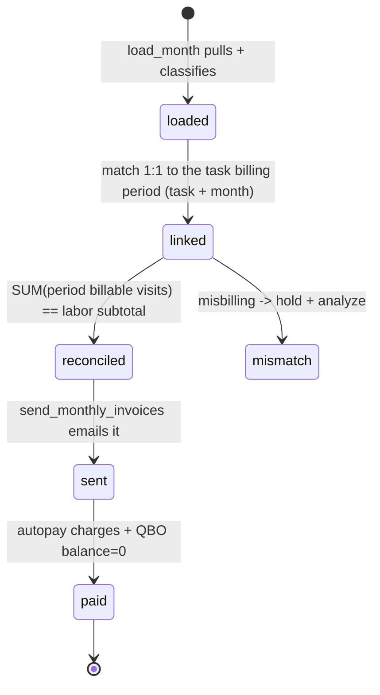

# Entity: Invoice — task-linked / maintenance (detail)

> Lives in: `billing_audit.maintenance_invoices` (+ `maintenance_invoice_line_items`)
> Source: [cache: QBO + native]   (QBO owns financial state; ION created it; we own classification + audit + send state)
> Status: [active]

## What it is

The **task-linked specialization** of the one [Invoice](invoice.md) entity — see that page for the unified, link-routed model. ION issues **one of these per task per month**, so it links **1:1** to a [Task Billing Period](task-billing-period.md) (the invoice promise). It is **born in ION** (built from the task's [Visits](visit.md) — `per_visit_rate × visits` or flat-rate, plus consumables) and synced to QBO. At month-end [load_month](../scripts/billing_audit/load_month.md) pulls it, detects it's maintenance (labor SKU), and derives billing analytics.

Native columns we add on top of the QBO data:
- **Classification**: `service_type`, `service_frequency`, `visit_count`, `per_visit_rate`, `chemical_total`, `chem_per_visit`
- **Promise link + reconciliation** (proposed — the bridge): links 1:1 to a [Task Billing Period](task-billing-period.md), which accrues the task's billable [Visits](visit.md) and runs two checks against this invoice — **labor** (expected vs labor subtotal, by amount) and **consumables** (used vs billed, **per-item quantity**, not price)
- **Audit**: `audit_status`, `audit_flag_level`, `audit_notes`, `audit_action_*`, `audit_reviewed_*`
- **Send state**: `send_status`, `send_held_reason`, `sent_at`
- **Balance**: `balance_due`, `balance_synced_at`

## Lifecycle

## Transitions — who writes what

| From | To | Caused by | What changes |
|---|---|---|---|
| (none) | `loaded` | [load_month](../scripts/billing_audit/load_month.md) | classification + derived analytics + line items |
| `loaded` | `audited` | [compute_chemical_estimates](../scripts/billing_audit/compute_chemical_estimates.md) benchmark check | `audit_flag_level`, `audit_status` |
| `audited` | `sent` / `held` | [send_monthly_invoices](../scripts/billing/send_monthly_invoices.md) | `send_status`, `sent_at` / `send_held_reason` |
| `sent` | `paid` | autopay charge + QBO reflection | `balance_due=0` |

## Connected entities

- [Customer](customer.md) via `qbo_customer_id`
- [Task Billing Period](task-billing-period.md) — linked 1:1; it accrues the task's billable [Visits](visit.md) and holds the reconciliation against this invoice's labor lines
- [Task](task.md) — coverage: every active task in the month should resolve to one of these invoices (missed-billing check)
- [Autopay Transaction](autopay-transaction.md) — the charge against it

## Flows this entity participates in

- [qbo-maintenance-invoices sync](../flows/sync/qbo-maintenance-invoices.md) — how it's loaded + classified
- [monthly-maintenance-billing](../flows/monthly-maintenance-billing.md) — audit, send, charge
