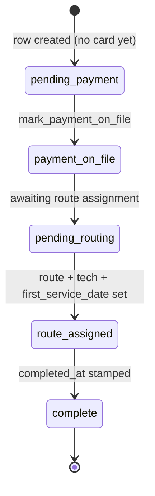

# Entity: Onboarding

> Lives in: `maintenance.onboarding`
> Status: [active]
> 0 rows (as of 2026-06-03) — the conversion path that populates it is being made whole; see [ADR 004](../adrs/004-leads-canonical-model.md)

## What it is

The post-conversion checklist state for a lead that has become a customer: payment-on-file,
preferred start, route/tech assignment, first service date, contract status. One row per
[Lead](lead.md) (`lead_id`, 1:1). Created when a card lands (`mark_payment_on_file`) or when
the onboarding questionnaire is submitted (`submit_maintenance_onboarding`); it tracks the
hand-off from "won the lead" to "scheduled and serviced".

It is the bridge between the [Lead](lead.md) pipeline and live [Maintenance ops](../SYSTEM_MAP.md)
(routes, visits) — a lead is `converted` once payment is on file; onboarding carries the
remaining operational setup.

## Field dictionary

| Field | Type | Describes | Values / constraints |
|---|---|---|---|
| `id` | uuid | Onboarding identity | PK, default `gen_random_uuid()` |
| `lead_id` | uuid | The lead being onboarded | NOT NULL; FK → [Lead](lead.md) `.id`; 1:1 |
| `status` | text | Onboarding stage | `pending_payment` → `payment_on_file` → `pending_routing` → `route_assigned` → `complete`; default `pending_payment` |
| `payment_on_file` | boolean | Card vaulted in QBO (the conversion gate) | default `false` |
| `payment_collected` | boolean | A payment has actually been taken | default `false` |
| `per_visit_rate` | numeric | Agreed per-visit rate ($) | nullable |
| `first_months_deposit` | numeric | First-month deposit ($) | nullable |
| `preferred_start_date` | date | Customer's requested start | nullable |
| `service_day_preference` | text | Preferred service day | nullable |
| `assigned_route` | text | Route assignment | nullable (set during routing) |
| `assigned_tech` | text | Technician assignment | nullable |
| `first_service_date` | date | First scheduled visit | nullable |
| `contract_status` | text | Service-agreement state | `not_started` \| `sent` \| `signed` |
| `created_at` / `updated_at` / `completed_at` | timestamptz | Timestamps | `completed_at` set when `status='complete'` |

## Lifecycle



The card-on-file step (`payment_on_file`) is the conversion gate. The routing tail
(`pending_routing` → `route_assigned` → `complete`) and the assignment columns
(`assigned_route`, `assigned_tech`, `first_service_date`, `contract_status`) exist but are
not yet driven by a flow — a future maintenance-ops handoff.

## Transitions — who writes what

| From | To | Caused by | What changes |
|---|---|---|---|
| (none) | `pending_payment` | `submit_maintenance_onboarding` | inserts row; sets `preferred_start_date`, `service_day_preference`; updates the primary `service_bodies` pool spec |
| (none)/`pending_payment` | `payment_on_file` | `mark_payment_on_file` | `payment_on_file=true`, `status='payment_on_file'`; also flips the [Lead](lead.md) child `status` to `converted` |
| `payment_on_file` | `route_assigned` | (manual / future ops flow) | `assigned_route`, `assigned_tech`, `first_service_date` |

## Connected entities

- [`Lead`](lead.md) via `onboarding.lead_id` (1:1).
- `maintenance.service_bodies` via the lead's `account_id` — onboarding edits the primary pool's specs.
- [`Customer`](customer.md) indirectly, through the lead's `account_id`.

## Flows this entity participates in

- [lead-intake-to-conversion](../flows/lead-intake-to-conversion/index.md) — onboarding is the
  conversion tail (card-on-file → operational setup).

## Common queries

```sql
-- Converted leads awaiting operational setup (card on file, not yet scheduled)
SELECT o.lead_id, c.display_name, o.status, o.payment_on_file,
       o.preferred_start_date, o.assigned_tech, o.first_service_date
FROM maintenance.onboarding o
JOIN public.leads l ON l.id = o.lead_id
JOIN public."Customers" c ON c.id = l.account_id
WHERE o.payment_on_file = true AND o.first_service_date IS NULL;
```

## Open questions / known gaps

- `submit_maintenance_onboarding` currently errors on `UPDATE public.leads SET status=...`
  (no such column); the conversion-status write belongs on `residential_lead_details.status`.
  Fixed in Phase 1 of [ADR 004](../adrs/004-leads-canonical-model.md).
- The `scheduled`/`completed` tail (route + tech + first-service assignment) has columns but
  no driving flow yet — a future maintenance-ops handoff.
