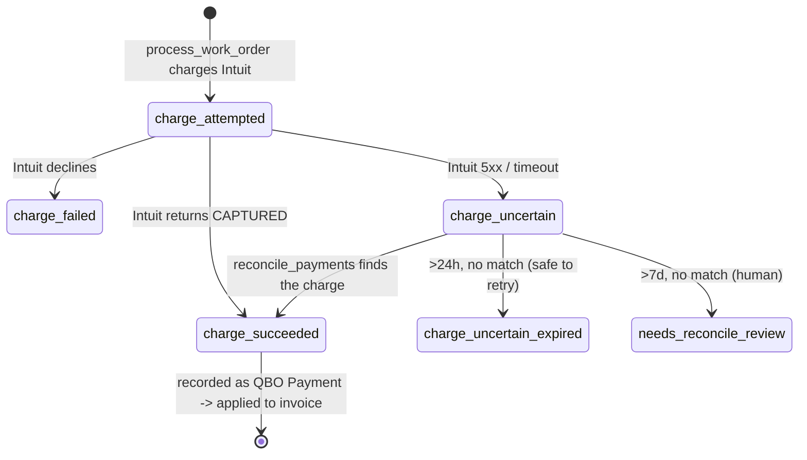

# Entity: Payment

> Lives in: `billing.customer_payments` (+ `billing.processing_attempts` for the attempt log)
> Source: [cache: QBO + native]   (QBO owns the recorded payment; we own the attempt log)
> Status: [active]

## What it is

Money applied to an invoice. There are two related row-shapes:

- **`billing.customer_payments`** — a payment recorded in QBO, mirrored into our cache. Includes both card/ACH charges and **credit memos** (`type='credit_memo'`). The `unapplied_amt` column tracks how much of a credit is still available to apply.
- **`billing.processing_attempts`** — our **native** append-only log of charge attempts. One row per attempt with a `status` (see lifecycle). This is the durable record that lets [reconcile_payments](../scripts/service_billing/reconcile_payments.md) resolve uncertain charges without double-charging.

The split matters: QBO is the leader for the *recorded* payment (the money that landed), but the *attempt* — including the uncertain in-between state — is ours, because QBO has no concept of "we tried to charge and don't yet know if it worked."

## Lifecycle (a charge attempt)



## Transitions — who writes what

| From | To | Caused by | What changes |
|---|---|---|---|
| (none) | `charge_attempted` | [process_work_order](../scripts/service_billing/process_work_order.md) calls Intuit Payments | new `processing_attempts` row |
| `charge_attempted` | `charge_succeeded` | Intuit returns `CAPTURED` | `status`, charge id / auth code |
| `charge_attempted` | `charge_failed` | Intuit declines | `status`, error detail |
| `charge_attempted` | `charge_uncertain` | Intuit 5xx / timeout (money may or may not have moved) | `status` |
| `charge_uncertain` | resolved | [reconcile_payments](../scripts/service_billing/reconcile_payments.md) polls Intuit | `status` per match result |
| `charge_succeeded` | recorded | [process_work_order](../scripts/service_billing/process_work_order.md) writes QBO Payment | `customer_payments` row (CCTransId) |

## Connected entities

- Each payment links to one or more [Invoices](invoice.md) via [payment_invoice_links](payment-link.md)
- Credit memos are `customer_payments` rows with `type='credit_memo'`; their `unapplied_amt` is what [pre_process_invoice](../scripts/service_billing/pre_process_invoice.md) draws down when auto-applying credits
- Each payment belongs to a [Customer](customer.md) via `qbo_customer_id`

## Flows this entity participates in

- [work-order-to-payment](../flows/work-order-to-payment/index.md) — the charge + record steps
- [cdc-reconciliation](../flows/cdc-reconciliation.md) — QBO Payment changes reflect back via the CDC reconciler
- [monthly-autopay](../flows/monthly-autopay.md) — autopay charges land here too

## Common queries

```sql
-- Charges stuck uncertain (the reconcile_payments queue)
SELECT * FROM billing.processing_attempts
 WHERE status = 'charge_uncertain';

-- Credits still available to apply
SELECT qbo_customer_id, unapplied_amt
  FROM billing.customer_payments
 WHERE type = 'credit_memo' AND unapplied_amt > 0;
```
