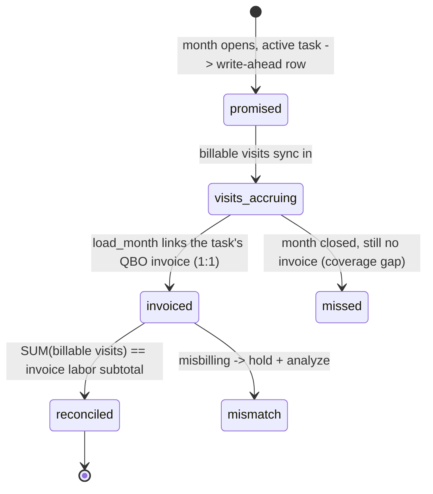

# Entity: Task Billing Period (invoice promise)

> Lives in: `billing_audit.task_billing_periods` (proposed)
> Source: [native]   (our write-ahead coordination row — exists in neither ION nor QBO)
> Status: [design]   (the bridge in [monthly-maintenance-billing](../flows/monthly-maintenance-billing.md))

## What it is

The **write-ahead invoice promise** for one [Task](task.md) in one month — one row per (`task_id`, `billing_month`). It is the middleman between ION and QBO: created at month-start from each active task (before any visit or invoice exists), it accrues the task's billable [Visits](visit.md) as they sync from ION, then watches for the task's invoice to land from QBO and reconciles the two.

**It is 1:1 with the invoice.** ION issues one [Invoice](invoice.md) (task-linked) per task per month, so each promise links to exactly one invoice — the same clean 1:1 shape as a work order and its invoice. A customer with N tasks has N promises and N invoices; their **customer-month total is the SUM of those promises** (a rollup view, and the future seam if invoices are ever consolidated in QBO — but ION syncs per-task today, which we respect).

## Why it's a row and not a query

Coverage ("did every active task get billed?") is a **completeness guarantee**, and a write-ahead checklist is more robust than inferring gaps by absence: "not yet billed" is `qbo_invoice_id IS NULL` on a row we know exists, created from the task itself. It's also the durable anchor that decouples ION (visits trickle in over the month) from QBO (invoice appears later), and it preserves the point-in-time expectation (which tasks were active, expected amount) even if the task is later paused or repriced. Same pattern as `billing.invoices` coordinating async arrivals in the service flow.

## Proposed shape

| Column | Purpose |
|---|---|
| `task_id`, `billing_month` | the grain (UNIQUE together) |
| `qbo_customer_id` | for the customer-month rollup |
| `expected_labor_cents` | `billable_visit_count × per_visit_rate`, or `flat_rate_monthly` (per [Task Schedule](task-schedule.md) `billing_method`) |
| `billable_visit_count` | billable visits accrued for this task-month |
| `qbo_invoice_id` | the matched [Invoice](invoice.md) (1:1, nullable until invoiced) |
| `status` | `promised` / `visits_accruing` / `invoiced` / `reconciled` / `mismatch` / `missed` |
| `labor_ok` | indicator: `expected_labor` vs invoice labor subtotal (amount) within tolerance |
| `consumables_ok` | indicator: per-item used quantity (`consumables_usage`) == billed quantity (chemical lines). **Quantity only — price not compared** (ION sets it at sync). Higher priority than labor. |
| `opened_at`, `reconciled_at`, `notes` | audit |

Reconciliation is **two checks**: labor by amount, consumables by per-item quantity. Both must pass to reach `reconciled`. The consumable check needs an ION-item -> QBO-item mapping (see [monthly-maintenance-billing](../flows/monthly-maintenance-billing.md) item-identity caveat).

## Lifecycle

## Connected entities

- [Task](task.md) — one promise per active task-month (the coverage unit)
- [Visit](visit.md) — billable visits **auto-link here by `task_id` + month** (visits carry `task_id`); accrued via `visits.billing_period_id`
- [Invoice](invoice.md) (task-linked) — linked 1:1 via `qbo_invoice_id` (matched by customer+month, disambiguated by rate/type/count); the subtotal compared against
- [Customer](customer.md) — customer-month total = SUM of the customer's promises

## Flows this entity participates in

- [monthly-maintenance-billing](../flows/monthly-maintenance-billing.md) — this entity IS the bridge
