# Entity: Task Billing Period (invoice promise)

> Lives in: `billing_audit.task_billing_periods`
> Source: [native]   (our write-ahead coordination row — exists in neither ION nor QBO)
> Status: [active]   built by [`f/billing_audit/build_task_billing_periods.py`](../../f/billing_audit/build_task_billing_periods.py), reconciled by [`f/billing_audit/reconcile_billing_periods.py`](../../f/billing_audit/reconcile_billing_periods.py). The bridge in [monthly-maintenance-billing](../flows/monthly-maintenance-billing/index.md).

## What it is

The **write-ahead invoice promise** for one [Task](task.md) in one month — one row per (`task_id`, `billing_month`). It is the middleman between ION and QBO: created from each active task, it accrues the task's billable [Visits](visit.md) and priced consumables as they sync from ION, then watches for the task's invoice to land from QBO and reconciles the two.

**It is 1:1 with the invoice.** ION issues one [Invoice](invoice.md) (task-linked) per task per month, so each promise links to exactly one invoice. A customer with N tasks has N promises and N invoices; their **customer-month total is the SUM of those promises** (the grain the reconcile rolls up to and compares against the customer's month-end invoice).

## Why it's a row and not a query

Coverage ("did every active task get billed?") is a **completeness guarantee**, and a write-ahead checklist is more robust than inferring gaps by absence: "not yet billed" is `qbo_invoice_id IS NULL` on a row we know exists, created from the task itself. It's the durable anchor that decouples ION (visits trickle in over the month) from QBO (invoice appears later), and it preserves the point-in-time expectation even if the task is later paused or repriced. Same pattern as `billing.invoices` coordinating async arrivals in the service flow.

## How the rollup is computed (the build step, as built)

`build_task_billing_periods.py` is a single idempotent SQL `UPSERT`. The promise set is **task-driven, not visit-driven**: every `(task, month)` with visits, PLUS every active `flat_rate_monthly` task in each effective month (a flat task bills even with zero visits). Per promise:

- **`billing_month`** = `date_trunc('month', visits.scheduled_date)`.
- **Collapse to billable *days* first.** Multiple ION logs on one task-day (a duplicate log, or a QC log beside the route log) collapse to **one** day. A day's price = `MAX(price_cents)` among that day's **billable** logs, where billable **excludes** non-serviceable days (holiday / no-access / skip), `$0` courtesy logs, and `QUALITY CONTROL` (non-billable labor — its consumables still bill).
- **`expected_labor_cents`:**
  - `flat_rate_monthly` task → the task's `flat_rate_monthly_cents`, **independent of visit count**.
  - everything else (`per_visit`, one-time) → the **task's** `price_per_visit_cents × billable_visit_count`. The **task dictates the rate and QC-ness**, not the visit: one ION contract = one rate, and a QC contract is its own task carrying `price_per_visit_cents = 0`, so its days multiply out to **$0 labor** (its consumables still bill). `billable_visit_count` = distinct *serviceable* service days (multiple logs on one day collapse to one).
- **`consumables`** = `{item_name: total_quantity}` summed from `consumables_usage` for the task-month (kept for the reconcile quantity check).
- **`expected_consumable_cents`** (Model B) = `SUM(item qty × unit_price_cents)`, priced by **`ion_item_id` → [`maintenance.consumables`](../../supabase/migrations/20260701010000_create_maintenance_consumables_catalog.sql)** (the consumable item master, 142 rows). Priced by `ion_item_id` — *not* `consumables_usage.item_id` — so it is immune to the `item_id` null-out. The catalog price is the **billed (QBO) price**, so the expected total reconciles against the invoice.
- **`unpriced_consumables`** = `{item_name: qty}` for items with no catalog price yet (`unit_price_cents IS NULL`, or an `ion_item_id` not in the catalog) — a **finite worklist** to drive to zero, never a silent undercount. (June 2026: 97% of rows priced from QBO; the ~36 unpriced items get a manual price.)
- **`expected_total_cents`** = **generated** `expected_labor_cents + expected_consumable_cents` — derived, so it can never disagree with its parts (one-writer discipline).
- Terms (`billing_method`, rates, `qbo_customer_id`, `service_location_id`) are read straight off the task. Customer = the canonical `ion.recurring_tasks.qbo_customer_id`, falling back to the address-resolved account.

The build also **deletes orphan promises** — rows not backed by visits that month and not an active flat task — so a re-keyed ION task (EventID split) doesn't leave a stale promise polluting reconcile. `dry_run=True` by default (upsert in a transaction, summarize, rollback).

**Live ledger + locking.** The builder is meant to run **continuously** (daily, or any time mid-month): each run re-UPSERTs the **open** months, so the table is always a current picture of where billing stands — mid-month revenue = `SUM(expected_total_cents)` over the current month, and a high-bill early-warning is a customer whose current-month `expected_total_cents` is already high. Once a month is billed + reconciled it is **locked** (`locked_at` stamped via `main(lock_through=<date>)`); every subsequent run **skips locked months entirely** — no wasted recompute, and a late retroactive visit edit can't disturb a closed month. Locked rows are never updated *or* deleted by the build.

## Shape

| Column | Purpose |
|---|---|
| `task_id`, `billing_month` | the grain (UNIQUE together) |
| `qbo_customer_id`, `service_location_id` | for the customer-month rollup |
| `billing_method`, `per_visit_rate_cents`, `flat_rate_monthly_cents` | task terms captured point-in-time |
| `visit_count`, `billable_visit_count` | distinct service days / billable days |
| `expected_labor_cents` | flat monthly amount, or SUM of per-day billable prices |
| `consumables` | `{item_name: total_qty}` — the qty map the reconcile checks |
| `expected_consumable_cents` | Model B: `SUM(qty × unit_price_cents)`, priced by `ion_item_id` → `maintenance.consumables` |
| `unpriced_consumables` | `{item_name: qty}` with no catalog price yet (finite worklist) |
| `expected_total_cents` | **generated** = labor + consumable |
| `qbo_invoice_id` | the matched [Invoice](invoice.md) (1:1, nullable until invoiced) |
| `invoice_labor_cents` | invoiced labor subtotal (set by reconcile) |
| `status` | `visits_accruing` → `reconciled` / `mismatch` / `missed` |
| `labor_ok`, `consumables_ok` | reconcile indicators (see below) |
| `locked_at` | finalized month; the builder skips it (never recomputes or deletes) |
| `opened_at`, `reconciled_at`, `notes`, timestamps | audit |

## Reconciliation (the reconcile step, as built)

Rolls the month's promises up to `(qbo_customer_id, billing_month)` and compares to the customer's month-end maintenance invoice(s):

- **`labor_ok`** — `|invoiced_labor − expected_labor| ≤ labor_tol` (dollar compare on labor lines; HALF HOUR / QUALITY CONTROL / SALT CELL CLEAN excluded from labor).
- **`consumables_ok`** — no item we recorded was **under-billed** beyond `cons_tol` (per-item quantity: used-qty ≤ billed-qty). Quantity only.
- **`reconciled`** iff both pass, else `mismatch`; `missed` if the month closed with no invoice.

> **Planned next (stage A2 / Model B total-match):** `expected_total_cents` is now computed on the promise, but reconcile does **not yet** compare it to the invoice **grand total** (labor $ + chemical $). Adding a `total_ok` (`|invoiced_total − expected_total| ≤ tol`, gated on `unpriced_consumables = {}`) turns the promise into a **pre-sync data-quality gate** — its purpose is (1) surface glaring QBO issues to fix **before** we sync to ION, and (2) confirm every visit for the month synced correctly before running analysis. It is **not** fraud/mispricing detection. Wire it into reconcile + surface on `maintenance_invoices` when we build A2.

## Lifecycle

```mermaid
stateDiagram-v2
  [*] --> visits_accruing : build -> write-ahead row per active task-month
  visits_accruing --> reconciled : invoice matched; labor $ and consumable qty OK
  visits_accruing --> mismatch : matched but labor or consumables off -> hold + analyze
  visits_accruing --> missed : month closed, still no invoice (coverage gap)
  reconciled --> [*]
```

Text fallback: a promise is born `visits_accruing`; the reconcile step moves it to `reconciled` (labor + consumables agree), `mismatch` (matched invoice but a check failed), or `missed` (closed month, no invoice).

## Connected entities

- [Task](task.md) — one promise per active task-month (the coverage unit); financial terms read off the task
- [Visit](visit.md) — billable visits roll up here by `task_id` + month
- [Invoice](invoice.md) (task-linked) — linked 1:1 via `qbo_invoice_id`; the subtotal compared against
- [Customer](customer.md) — customer-month total = SUM of the customer's promises

## Flows this entity participates in

- [monthly-maintenance-billing](../flows/monthly-maintenance-billing/index.md) — this entity IS the bridge
