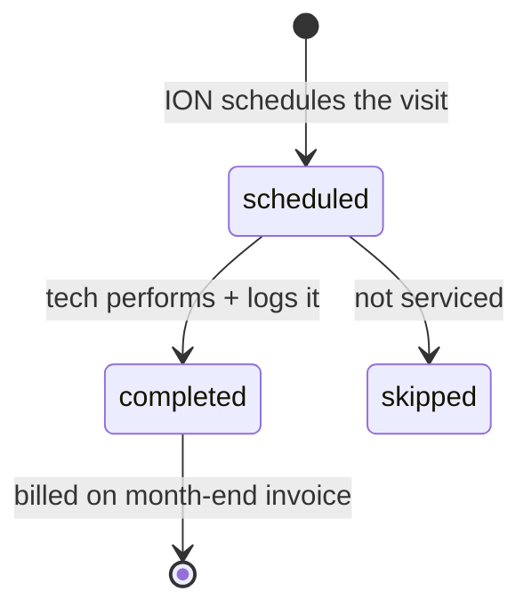

# Entity: Visit

> Lives in: `maintenance.visits`
> Source: [cache: ION + native]   (ION owns the occurrence; we own the schedule link + billing fields)
> Status: [active]

## What it is

One service visit to a pool — a tech showing up on a day and doing the work. It is the operational record of what was actually performed, and (per [monthly-maintenance-billing](../flows/monthly-maintenance-billing/index.md)) the basis ION uses to build the month-end invoice: `per_visit_rate × completed visits` (or a flat monthly rate), plus consumables used.

Synced from ION by [ion-visits sync](../flows/sync/ion-visits.md). Per-visit detail hangs off it: [chem_readings], [consumables_usage], [visit_tasks].

## Lifecycle



## Transitions — who writes what

| From | To | Caused by | What changes |
|---|---|---|---|
| (none) | `scheduled` | [ion-visits sync](../flows/sync/ion-visits.md) | occurrence row, scheduled tech/date |
| `scheduled` | `completed` | ION log scraped | actual tech, started/ended, status; readings/consumables/tasks attached |

## Billability (the bridge to billing)

Each visit carries (proposed) two billing fields:
- **`billable`** — true for a completed, chargeable visit; false for skipped / courtesy / warranty / redo. A per-visit fact.
- **`billing_period_id`** — FK to its task-month [Task Billing Period](task-billing-period.md) (the invoice promise). Billable visits accrue to the promise; the promise links 1:1 to the task's [Invoice](invoice.md). So "visits billed within invoice X" = visits whose period's `qbo_invoice_id` is X, and the reconciliation sums the period's billable visits against that invoice's labor subtotal.

## Connected entities

- [Task Schedule](task-schedule.md) via `task_schedule_id` — the cadence + price this visit instantiates
- [Task Billing Period](task-billing-period.md) via `billing_period_id` — the invoice promise this visit accrues to
- [Work Order](work-order.md) via `work_order_wo_number` / `ion_work_order_id`
- [Employee](employee.md) via `scheduled_tech_id` / `actual_tech_id`
- Per-visit detail: `maintenance.chem_readings`, `maintenance.consumables_usage`, `maintenance.visit_tasks`

## Flows this entity participates in

- [ion-visits sync](../flows/sync/ion-visits.md) — how visits enter the cache
- [monthly-maintenance-billing](../flows/monthly-maintenance-billing/index.md) — the basis for the month-end invoice + the (proposed) visits-vs-invoice reconciliation

## Common queries

```sql
-- Completed visits for a location in a billing month
SELECT visit_date, actual_tech_id, status
  FROM maintenance.visits
 WHERE service_location_id = $1
   AND date_trunc('month', visit_date) = $2
   AND status = 'completed';
```
