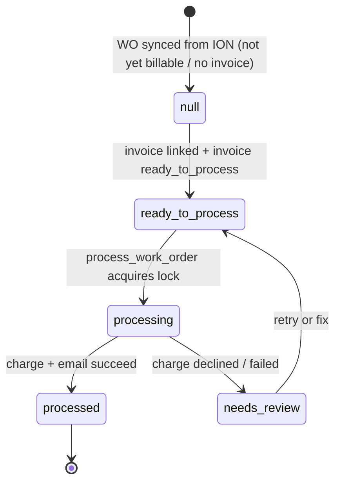

# Entity: Work Order

> Lives in: `public.work_orders`
> Source: [cache: ION + native]   (per-column leadership — see below)
> Status: [active]
> ~3,200 rows

## What it is

A unit of field work in ION Pool Care — a repair, install, delivery, or one-time clean. Created in ION, synced into our cache by [ion-work-orders sync](../flows/sync/ion-work-orders.md). It's the origin of the whole service-billing pipeline: a closed WO with an invoice number is what kicks off billing.

## Per-column leadership

This is a mixed-leadership table. Critical to get right — writing an ION-owned column from our side, or letting the ION sync clobber our column, both cause bugs.

| Columns | Leader | Who writes |
|---|---|---|
| `wo_number` (PK), `type`, `wo_status`, `approval_status`, `schedule_status`, `customer`, `address`, `sub_total`, `tax_total`, `total_due`, `invoice_number`, `completed`, `scheduled`, `assigned_to`, ~25 more | **ION** | [ion-work-orders sync](../flows/sync/ion-work-orders.md) only |
| `billable` | **derived** (Postgres GENERATED column from `billable_override` + `schedule_status`) | computed by Postgres |
| `billable_override` | **us** | manual/UI input to the generated column |
| `employee_id` | **derived** | reconciled from `assigned_to` via `ion_username` lookup during sync |
| `billing_status`, `billing_status_set_at`, `needs_review_reason` | **us (service-billing)** | [process_work_order](../scripts/service_billing/process_work_order.md) + a WO trigger |

How the split is preserved: the ION sync's DataFrame only contains ION columns, so its upsert never touches `billing_status`. See [ion-work-orders sync](../flows/sync/ion-work-orders.md).

## Lifecycle (our `billing_status` column)

The ION-owned fields change whenever ION changes (synced every 4h). The `billing_status` is OUR state machine:



## Transitions — who writes what

| From | To | Caused by | What changes |
|---|---|---|---|
| (synced, no billing) | `ready_to_process` | trigger on `public.work_orders` when its invoice reaches `ready_to_process` | `billing_status`, `billing_status_set_at` |
| `ready_to_process` | `processing` | [process_work_order](../scripts/service_billing/process_work_order.md) acquires concurrency lock | `billing_status='processing'` |
| `processing` | `processed` | [process_work_order](../scripts/service_billing/process_work_order.md) final step after invoice flips to processed | `billing_status='processed'` |
| `processing` | `needs_review` | charge declined/failed | `billing_status`, `needs_review_reason` |

## Connected entities

- [Invoice](invoice.md) — linked via `work_orders.invoice_number == billing.invoices.doc_number`. This link (`work_orders.qbo_invoice_id`) is OUR domain data — it exists in neither ION nor QBO. See [ADR 001](../adrs/001-platform-architecture.md).
- [Employee](employee.md) — `employee_id` (the assigned tech), reconciled from ION's `assigned_to`.
- [Visit](visit.md) — `maintenance.visits.work_order_wo_number` FKs here (maintenance side).

## Flows this entity participates in

- [ion-work-orders sync](../flows/sync/ion-work-orders.md) — how it gets into our cache (inbound)
- [work-order-to-payment](../flows/work-order-to-payment.md) — the billing process it drives

## Common queries

```sql
-- WOs awaiting billing (closed, billable, have an invoice, not yet processed)
SELECT wo_number, customer, invoice_number, sub_total, billing_status
  FROM public.work_orders
 WHERE billable = true
   AND wo_status = 'Closed'
   AND invoice_number IS NOT NULL
   AND billing_status IS DISTINCT FROM 'processed';

-- WOs stuck in review with the reason
SELECT wo_number, customer, needs_review_reason
  FROM public.work_orders
 WHERE billing_status = 'needs_review';
```
