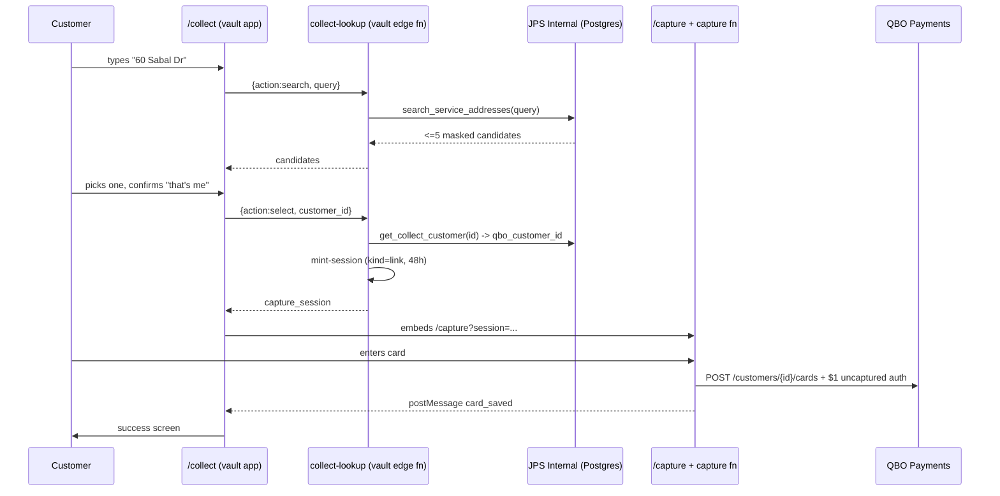

# Flow: Card-on-file collection (customer self-service)

> Status: [active] — LIVE at https://secure.jeffspoolspa.com/collect as of 2026-08-04.
> First real capture succeeded the same day (T. McTest, QBO 7657, Visa ···3686).
> Kind: [customer-facing]
> Entities: [Payment Method](../../entities/payment-method.md), [Customer](../../entities/customer.md), [Service Location](../../entities/service-location.md)
> External: QBO Payments (card/ACH vaulting)

## What this is

One **generic** link — `https://secure.jeffspoolspa.com/collect` — sent to customers in bulk
email/SMS, that lets them put a card or bank account on file themselves.

It is generic on purpose: minting 7,000 per-customer tokens for a bulk send is impractical, and a
tokenized link breaks the moment it is forwarded or reused. The cost of that choice is that the
page has to work out *who the customer is* before it can vault anything — which it does by asking
for their **service address**.

## The four steps

| Step | What the customer sees | What happens underneath |
|---|---|---|
| 1. Find | "Service address" input | Debounced (350 ms) `collect-lookup {action:"search"}` → `public.search_service_addresses` |
| 2. Confirm | "Is this you?" + masked name + address | Nothing yet — pure confirmation |
| 3. Card | Card / Bank account tabs + $1-hold notice | `collect-lookup {action:"select"}` mints a capture session; the page embeds `/capture` |
| 4. Done | "You're all set", brand + last 4 | The vault already POSTed the method to QBO |

## Why the pieces live where they do

- **The page is in the vault app, not the Next.js app.** It needs to run *before* a session
  exists, and it must not put the internal Supabase key or `VAULT_SECRET_KEY` in the browser.
  Living beside `/capture` lets one edge function hold both credentials server-side.
- **The card fields are still `/capture` in an iframe.** Same origin here, so the iframe is not a
  security boundary in this context — it is reuse. `/capture` is the proven, already-deployed
  component that talks to the capture function; `/collect` never touches a card number, which
  keeps it freely editable.
- **The enumeration guardrails are in SQL, not in the page.** The page is JavaScript any caller
  can bypass by hitting PostgREST directly with the (public) anon key. See below.

## The disclosure this design accepts

A generic link plus an address search means an unauthenticated caller can turn **an address they
already know** into "there is a pool customer here, surname X". That is the minimum disclosure a
self-identifying form requires. It is bounded by four properties enforced inside
`public.search_service_addresses`:

1. An **exact house number** is required, and it must match the address's leading digits.
2. At least **3 letters** of street name are required — after the generic street-type word
   (`Drive`, `St`, `Rd`…) is stripped, so "60 drive" matches nothing.
3. **LIMIT 5, no paging.** There is no way to walk the table.
4. Names come back **masked** (first initial + surname); no email, phone, or balance.

Verified against production 2026-08-04: `60 Sabal Drive`, `60 Sabal Dr`, `60 sabal`, and the typo
`60 Sabel Drive` each return exactly 1 row; `Sabal Drive`, `60`, `60 drive`, `%`, and `NULL` each
return 0 — including over plain HTTP as `anon`.

If that residual disclosure ever becomes unacceptable, the fix is **per-customer tokenized
links**, not a tighter search.

## Go-live checklist

Nothing below is done yet — the code is written, type-checked, built, and driven end-to-end
locally against real data, but the form is not live.

- [x] `search_service_addresses` + `get_collect_customer` + `normalize_street_name` applied to
      production (migration `20260804120000_public_service_address_lookup.sql`).
- [x] `collect-lookup` edge function deployed to the vault project (`rjxhummrmyigngdqiuic`),
      **v2**, and verified live: `search` returns the right single candidate, enumeration
      returns `[]`, and `select` minted a real `link` session for customer 2 / QBO 8264.
      It needs **no new edge secrets** — `VAULT_SECRET_KEY` and `SUPABASE_URL` were already set
      on the project, and the internal project's URL + anon key are inlined (both are public
      "publishable" values; see the function header for why).
- [x] **The second QBO refresher is gone.** `f/qbo/get_access_token` no longer refreshes: it is
      now a cache that DELEGATES rotation to `f/qbo/api/get_access_token` (ADR 012,
      `concurrent_limit=1`). Verified — two back-to-back calls returned a valid token while the
      one door ran exactly once, so a burst of captures cannot storm the rotation.
- [x] **Collect app deployed.** Vercel project `card-vault-collect` (repo
      `jeffspoolspa/card-vault-pro`, branch `main` — NOT `jeffspoolspa/card-vault`, which is a
      stale lineage that still contains the legacy collection forms). Pushing to `main` there
      auto-deploys to `secure.jeffspoolspa.com`.
- [x] **`QBO_BASE_URL` is production.** Proven, not assumed: after the live capture,
      `pull_customer_payment_methods(only_customer_id='7657')` read the new Visa ···3686 back
      out of **production** QBO. A sandbox-bound card could not have appeared there.
- [x] **`WINDMILL_QBO_TOKEN_URL` works.** The live capture obtained a QBO token through it, so
      it is a `run_wait_result`-shaped webhook as required.
- [x] One end-to-end test with a real card — done by Carter 2026-08-04, succeeded.
- [x] **Refactored so the vault holds no domain knowledge** and rolled out 2026-08-04.
      `/collect` now calls `POST internal.jeffspoolspa.com/api/card-collection/resolve`;
      the vault's `collect-lookup` is retired to a 410 tombstone (delete it in the Supabase
      dashboard when convenient — there is no delete API exposed to the agent).
- [x] **Duplicate detection + expired-card rejection live** (capture v10).
- [ ] **Re-test with a real card** to confirm two things that have not run in production:
      the wallet auto-refresh webhook, and the `card_exists` path. Add a card, then add the
      SAME card again — expect "already on file" and no second $1 hold.

## Known gaps

- **No duplicate detection.** If a customer submits a card already on file, the vault POSTs it to
  QBO again and a second payment-method token comes back. Nothing dedupes by last-4 + expiry, in
  the vault or in `billing.customer_payment_methods` (whose upsert keys on
  `qbo_payment_method_id`, which differs per submission). Worth adding before a bulk send, since
  bulk sends are exactly when people re-submit.
- **No rate limiting** on `collect-lookup`. The SQL guardrails make enumeration impractical rather
  than impossible; a per-IP limit would close the gap on brute-forcing house numbers along a
  known street.
- **Wallet cache refresh — fixed, but not yet proven in production.** The first live capture put
  the card in QBO and left `billing.customer_payment_methods` empty: the customer saw "You're all
  set" while staff saw "No payment methods on file". The daily sweep selects customers by joining
  `billing.invoices`, so a customer with no open invoice is never swept at all.

  `capture` now calls `pull_customer_payment_methods(only_customer_id=<qbo id>)` after the card
  is vaulted (`notifyWalletRefresh` in `_shared/qbo.ts`). It is fired **server-side, from the
  vault** rather than from the `/collect` page — the page is the browser, and a customer closing
  the tab on the success screen would skip it entirely. It derives the webhook URL from
  `WINDMILL_QBO_TOKEN_URL` so it needs no new secret, and it never throws or blocks: the card is
  already saved by that point, so a failed refresh must not turn a success into an error.

  **Unverified:** whether the vault's `WINDMILL_TOKEN` is scoped to run that script, and whether
  the URL derivation matches the real secret's shape. If the next capture still leaves the cache
  empty, check the vault's edge logs for a line starting `wallet refresh` — the failure is logged
  there, with the HTTP status. Fallback if the token lacks permission: set
  `WINDMILL_PM_REFRESH_URL` explicitly on the vault project (the code prefers it over the
  derived URL).

## Cross-references

- Entity: [Payment Method](../../entities/payment-method.md) — the vault contract in full
- The internal (staff-facing) equivalent: `app/(shell)/customers/[id]/payment-methods`
- Vault repo: `~/card-vault` (`apps/collect`, `supabase/functions/collect-lookup`)
