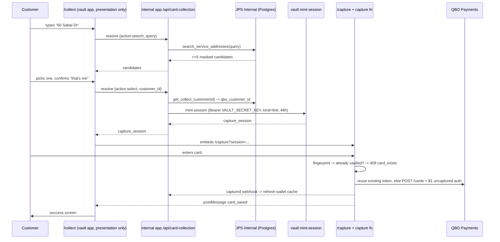

# Flow: Card-on-file collection (customer self-service)

> Status: [active] — LIVE at https://secure.jeffspoolspa.com/collect as of 2026-08-04.
> First real capture succeeded the same day (T. McTest, QBO 7657, Visa ···3686).
> Kind: [customer-facing]
> Entities: [Payment Method](../../entities/payment-method.md), [Customer](../../entities/customer.md), [Service Location](../../entities/service-location.md)
> External: QBO Payments (card/ACH vaulting)

## What this is

One **generic** link — `https://secure.jeffspoolspa.com/collect` — sent to customers in bulk
email/SMS, that lets them put a card or bank account on file themselves.

It is generic on purpose: minting 7,000 per-customer tokens for a bulk send is impractical, and a
tokenized link breaks the moment it is forwarded or reused. The cost of that choice is that the
page has to work out *who the customer is* before it can vault anything — which it does by asking
for their **service address**.

## The four steps

| Step | What the customer sees | What happens underneath |
|---|---|---|
| 1. Find | "Service address" input | Debounced (350 ms) `POST /api/card-collection/resolve {action:"search"}` → `public.search_service_addresses` |
| 2. Confirm | "Is this you?" + masked name + address | Nothing yet — pure confirmation |
| 3. Card | Card / Bank account tabs + $1-hold notice | `{action:"select"}` re-resolves the customer, mints a capture session via the vault, and the page embeds `/capture` |
| 4. Done | "You're all set", brand + last 4 | The vault vaulted the method in QBO and announced it to `/api/card-collection/captured` |

## Why the pieces live where they do

- **The page is in the vault app; the DOMAIN is not.** `/collect` is presentation only. It knows
  one URL and nothing about customers, addresses or how a match is decided. The first cut put that
  lookup in a vault edge function, which meant a payments service held the internal database's
  URL, anon key and RPC names — re-coupling it to the business database that card-vault commit
  `6babb96` deliberately cut it loose from ("capture no longer reads the business DB").
- **Minting authority lives with the system that owns customer identity.** A capture session
  encodes which customer a card attaches to, so requesting one IS the authority to make that
  claim. The internal app therefore holds `VAULT_SECRET_KEY`. That is the point of the design, not
  its cost — avoiding the secret is exactly what dragged the schema across the boundary before.
  The vault still MINTS, validates and expires every session; our app only asks.
- **The card fields are still `/capture` in an iframe.** Same origin as `/collect`, so here it is
  reuse rather than a security boundary — `/collect` never touches a card number, which keeps it
  freely editable. The boundary that matters is against the *internal app*, which is a different
  origin.
- **The enumeration guardrails are in SQL, not in the page or the route.** Both are bypassable by
  hitting PostgREST directly with the (public) anon key. See below.

## The disclosure this design accepts

A generic link plus an address search means an unauthenticated caller can turn **an address they
already know** into "there is a pool customer here, surname X". That is the minimum disclosure a
self-identifying form requires. It is bounded by four properties enforced inside
`public.search_service_addresses`:

1. An **exact house number** is required, and it must match the address's leading digits.
2. At least **3 letters** of street name are required — after the generic street-type word
   (`Drive`, `St`, `Rd`…) is stripped, so "60 drive" matches nothing.
3. **LIMIT 5, no paging.** There is no way to walk the table.
4. Names come back **masked** (first initial + surname); no email, phone, or balance.

Verified against production 2026-08-04: `60 Sabal Drive`, `60 Sabal Dr`, `60 sabal`, and the typo
`60 Sabel Drive` each return exactly 1 row; `Sabal Drive`, `60`, `60 drive`, `%`, and `NULL` each
return 0 — including over plain HTTP as `anon`.

If that residual disclosure ever becomes unacceptable, the fix is **per-customer tokenized
links**, not a tighter search.

## Go-live checklist

Rolled out 2026-08-04. One item remains, and it needs a real card.

- [x] `search_service_addresses` + `get_collect_customer` + `normalize_street_name` applied to
      production (migration `20260804120000_public_service_address_lookup.sql`).
- [x] **Resolver live** at `POST internal.jeffspoolspa.com/api/card-collection/resolve`, verified
      in production: `search` returns the right single candidate, enumeration returns `[]`, CORS
      opens only for `secure.jeffspoolspa.com`, and `select` mints a real `link` session.
      (It briefly lived as a vault edge function; see the refactor entry below for why it moved.)
- [x] **The second QBO refresher is gone.** `f/qbo/get_access_token` no longer refreshes: it is
      now a cache that DELEGATES rotation to `f/qbo/api/get_access_token` (ADR 012,
      `concurrent_limit=1`). Verified — two back-to-back calls returned a valid token while the
      one door ran exactly once, so a burst of captures cannot storm the rotation.
- [x] **Collect app deployed.** Vercel project `card-vault-collect` (repo
      `jeffspoolspa/card-vault-pro`, branch `main` — NOT `jeffspoolspa/card-vault`, which is a
      stale lineage that still contains the legacy collection forms). Pushing to `main` there
      auto-deploys to `secure.jeffspoolspa.com`.
- [x] **`QBO_BASE_URL` is production.** Proven, not assumed: after the live capture,
      `pull_customer_payment_methods(only_customer_id='7657')` read the new Visa ···3686 back
      out of **production** QBO. A sandbox-bound card could not have appeared there.
- [x] **`WINDMILL_QBO_TOKEN_URL` works.** The live capture obtained a QBO token through it, so
      it is a `run_wait_result`-shaped webhook as required.
- [x] One end-to-end test with a real card — done by Carter 2026-08-04, succeeded.
- [x] **Refactored so the vault holds no domain knowledge** and rolled out 2026-08-04.
      `/collect` now calls `POST internal.jeffspoolspa.com/api/card-collection/resolve`;
      the vault's `collect-lookup` is retired to a 410 tombstone (delete it in the Supabase
      dashboard when convenient — there is no delete API exposed to the agent).
- [x] **Duplicate detection + expired-card rejection live** (capture v10).
- [ ] **Re-test with a real card** to confirm two things that have not run in production:
      the wallet auto-refresh webhook, and the `card_exists` path. Add a card, then add the
      SAME card again — expect "already on file" and no second $1 hold.

## Known gaps

- **No rate limiting** on `/api/card-collection/resolve`. The SQL guardrails make enumeration
  impractical rather than impossible; a per-IP limit would close the gap on brute-forcing house
  numbers along a known street.
- **One shared vault key, no client identity.** `mint-session` compares against a single
  `VAULT_SECRET_KEY` with no notion of who is calling, so there is no per-consumer rotation,
  revocation or attribution. Fine while the internal app is the only consumer; the trigger to
  build a `vault_clients` table (hashed key per client, stamping the already-existing but unused
  `capture_sessions.created_by`) is consumer number two. That same key is currently reused to
  authenticate the inbound capture webhook, which would be the first thing to untangle.
- **Wallet cache refresh — fixed, but not yet proven in production.** The first live capture put
  the card in QBO and left `billing.customer_payment_methods` empty: the customer saw "You're all
  set" while staff saw "No payment methods on file". The daily sweep selects customers by joining
  `billing.invoices`, so a customer with no open invoice is never swept at all.

  `capture` now calls `pull_customer_payment_methods(only_customer_id=<qbo id>)` after the card
  is vaulted (`notifyWalletRefresh` in `_shared/qbo.ts`). It is fired **server-side, from the
  vault** rather than from the `/collect` page — the page is the browser, and a customer closing
  the tab on the success screen would skip it entirely. It derives the webhook URL from
  `WINDMILL_QBO_TOKEN_URL` so it needs no new secret, and it never throws or blocks: the card is
  already saved by that point, so a failed refresh must not turn a success into an error.

  **Unverified:** whether the vault's `WINDMILL_TOKEN` is scoped to run that script, and whether
  the URL derivation matches the real secret's shape. If the next capture still leaves the cache
  empty, check the vault's edge logs for a line starting `wallet refresh` — the failure is logged
  there, with the HTTP status. Fallback if the token lacks permission: set
  `WINDMILL_PM_REFRESH_URL` explicitly on the vault project (the code prefers it over the
  derived URL).

## Cross-references

- Entity: [Payment Method](../../entities/payment-method.md) — the vault contract in full
- The internal (staff-facing) equivalent: `app/(shell)/customers/[id]/payment-methods`
- Vault repo: `~/card-vault` (`apps/collect`, `supabase/functions/capture`) — deploys to Vercel
  project `card-vault-collect` from **`jeffspoolspa/card-vault-pro` branch `main`**. Note edge
  functions do NOT deploy on git push; they are deployed separately.
