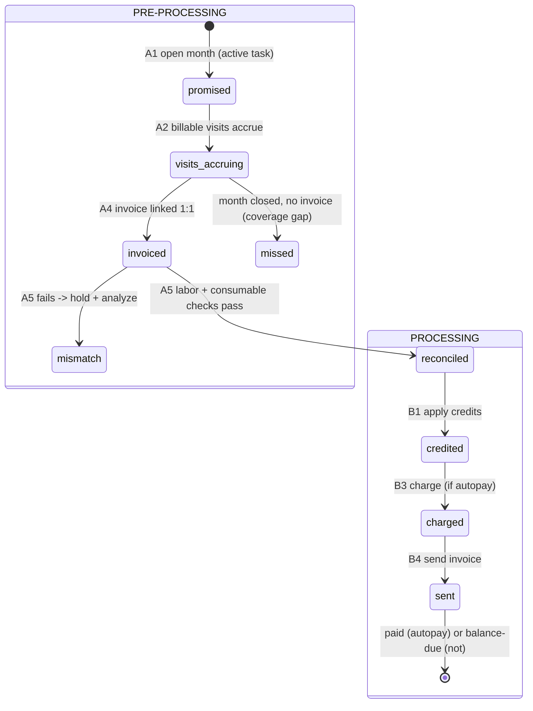

# Flow: Monthly Maintenance Billing

> Status: [active]
> Kind: [orchestration]
> Verification: [verified] for the charging steps (as-built autopay); [design] for the visit→invoice linking (new)
> Domain: maintenance
> Entities: [Visit](../entities/visit.md), [Task](../entities/task.md), [Task Billing Period](../entities/task-billing-period.md), [Invoice](../entities/invoice.md) (task-linked), [Autopay Transaction](../entities/autopay-transaction.md)

## The crux

Visits accumulate over a month; ION builds one invoice per task; we reconcile it against the visits, then charge + send it. The workflow is two phases over the **[Task Billing Period](../entities/task-billing-period.md)** (the write-ahead invoice promise, one per active task-month):

- **Pre-processing** — get the invoice linked and reconciled (the new bridge). Done when `reconciled`.
- **Processing** — credits, charge (if autopay), payment, send — mirrors per-WO [work-order-to-payment](work-order-to-payment.md), just per task-linked invoice.

Routing: there is **one [Invoice](../entities/invoice.md) entity** routed by what it links to ([ADR 003](../adrs/003-unify-invoice-table.md)). Task-linked invoices run this flow; one invoice per task per month (a customer with N tasks gets N invoices; monthly total = the SUM).

## Lifecycle

## Phase A — Pre-processing (link + reconcile)

| Step | Input | Output | Period state |
|---|---|---|---|
| **A1 Open the month** — scheduled job on the 1st | active [Tasks](../entities/task.md) (`starts_on <= M-01 AND (ends_on IS NULL OR ends_on >= M-01)`) | one period per active task (the coverage checklist) | `promised` |
| **A2 Accrue visits** — fed by [ion-visits sync](sync/ion-visits.md) | billable [Visits](../entities/visit.md), **auto-linked to their period by `task_id` + month** (97.5% of visits carry `task_id`) | period **labor** (`billable_visit_count`, `expected_labor` = count × rate or flat) + **consumables** (per-item used quantity) | `visits_accruing` |
| **A3 Sync invoices** — universal QBO invoice sync | all QBO invoices | rows in `billing.invoices` (cached) | (unchanged) |
| **A4 Link invoice → period** — [load_month](../scripts/billing_audit/load_month.md) / sync match | a synced task invoice + open periods | `period.qbo_invoice_id` set 1:1; invoice `link_kind=task` | `invoiced` |
| **A5 Reconcile** | period (expected) + invoice (billed) | `labor_ok` (amount) + `consumables_ok` (per-item quantity) | `reconciled` (eligible) or `mismatch` (held) |

**A4 matching:** the promise is 1:1 with the QBO invoice. Match by `(qbo_customer_id, month)` — trivial for the ~95% single-task customers. Multi-task customers disambiguate by `service_type` + per-visit rate (encoded in the labor item name, e.g. "POOL MAINTENANCE 65") + visit count. **Billing-safe even when two pools have identical terms:** identical promises expect the same amount, so the reconciliation and charge are correct whichever one the invoice matches — only per-pool *attribution* is imperfect. Precise attribution (deferred) comes from capturing the invoice's **service location/address** or having the [ION API](../integrations/ion.md) **stamp the task id** onto the invoice ([ADR 002](../adrs/002-ion-api-layer.md)). An invoice that matches no promise = orphan, surfaced for review.

**A5 reconcile = two checks:**
- **Labor** — `expected_labor` vs invoice labor subtotal (by amount; flat-rate uses the flat amount).
- **Consumables** — per-item **quantity** match (`consumables_usage` vs chemical line quantities). **Price is not compared** (ION sets it at sync). Higher priority than labor; needs an ION-item → QBO-item mapping (from `billing_audit.consumable_items`).

**Coverage sweep:** at month close any period still `promised`/`visits_accruing` (no invoice) = **missed billing**.

## Phase B — Processing (charge + send, per reconciled invoice)

Mirrors [work-order-to-payment](work-order-to-payment.md). Detailed scripts live in [monthly-autopay](monthly-autopay.md).

| Step | Input | Output |
|---|---|---|
| **B1 Apply credits** — [apply_maint_credits](../scripts/billing/apply_maint_credits.md) | invoice + customer's unapplied payments / credit memos | credits applied in QBO; balance reduced |
| **B2 Autopay decision** | invoice's customer -> [Autopay Customer](../entities/autopay-customer.md) roster | branch: autopay (charge) vs not (invoice only) |
| **B3 Charge (if autopay)** — charge step of [monthly-autopay](monthly-autopay.md) | invoice balance + customer payment method | **success**: QBO Payment created + applied to invoice + receipt emailed. **decline**: card-declined email + `consecutive_declines++` |
| **B4 Send invoice** — [send_monthly_invoices](../scripts/billing/send_monthly_invoices.md) | the invoice (any customer) | invoice emailed — **paid** if autopay charged, **balance due** if not |
| **B5 Finalize / reflect** | charge + send results | QBO balance reflects (via [sync_invoice_balances](../scripts/billing/sync_invoice_balances.md)); run stats in `billing_runs` |

**Autopay grain:** the roster is **per-customer** (payment method is customer-level in QBO; enrollment is a customer decision). Processing is **per-invoice** (per task) and looks up the customer's autopay status — no task-grain on the roster unless a real per-task-enrollment need appears.

## The payoff: deeper misbilling + chemical analysis

Linking visits to the invoice sharpens the audit we already run ([compute_chemical_estimates](../scripts/billing_audit/compute_chemical_estimates.md) -> `audit_flag_level`): misbilling (expected vs billed labor + count) and chemical usage (used vs billed **quantity**). Flagged problems are eventually **corrected back in ION** via the [ION API](../integrations/ion.md) write-back ([ADR 002](../adrs/002-ion-api-layer.md)) — closing the loop.

## Decided / open

- **Consumable quantity check in v1** (higher priority than labor); price not compared.
- **Invoice unification: one link-routed table** ([ADR 003](../adrs/003-unify-invoice-table.md)); refactor autopay onto it, proven by a behavioral-equivalence dry_run.
- **Deferred — per-pool attribution** for identical-term multi-task customers (billing is already correct; capture service address or stamp task id via ION API for exact per-pool attribution).
- **PREREQUISITE GAP — there is no recurring task sync.** The visit→task link is by `service_location_id` against `maintenance.tasks` (the ION visit report carries no task id). But all 469 tasks were created+last-updated on **2026-04-26** — a one-time ION import, never refreshed. Visits sync continuously, so **every customer onboarded after 2026-04-26 has visits but no task** (144 task-less visits across 27 locations as of 2026-06, e.g. SHIPWATCH). The task-driven model needs an **ongoing ION → `maintenance.tasks` / `task_schedules` sync** (currently missing — the maintenance analog of ion-work-orders / ion-visits). Until it exists, new customers silently fall out of maintenance billing. `task_id` on a visit is an **invariant**; the coverage check surfaces violations.
- **Open — tolerance** for the checks: likely exact on consumable quantity, small tolerance on labor amount.
- **Known gap — no CDC backstop** for `billing_audit` balances; reflection is the `sync_invoice_balances` poll only.

## Cross-references

- Input: [ion-visits sync](sync/ion-visits.md) · Invoice load: [qbo-maintenance-invoices](sync/qbo-maintenance-invoices.md) ([load_month](../scripts/billing_audit/load_month.md))
- Charging engine: [monthly-autopay](monthly-autopay.md)
- Sibling (per-WO): [work-order-to-payment](work-order-to-payment.md)
- Entities: [Visit](../entities/visit.md), [Task](../entities/task.md), [Task Billing Period](../entities/task-billing-period.md), [Invoice](../entities/invoice.md)
- Decisions: [ADR 002 (ION API)](../adrs/002-ion-api-layer.md), [ADR 003 (unify invoice)](../adrs/003-unify-invoice-table.md), [ADR 001 (platform)](../adrs/001-platform-architecture.md)
