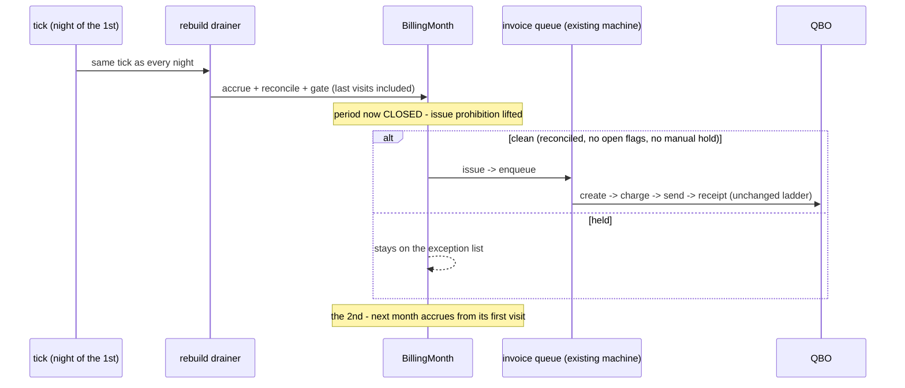

# Nightly Accrual Cadence — flow map

> Status: [proposed]
> Parent: [index.md](index.md)

## The nightly tick (every night, all month)

```mermaid
sequenceDiagram
    participant Cron as pg_cron (tick = one POST)
    participant R as tick route (/api/billing/tick)
    participant BM as BillingMonth aggregate
    participant ION as ION (checksum + logs)
    participant UI as Month page (review)

    Cron->>R: wake — pg_net POST, shared machine token
    Note over R: reads billing.v_active_months (the Specification)
    loop each active month
        R->>BM: accrue (re-fold visits, re-claim unlocked items)
        R->>ION: fetch rebuilt invoice total per task (checksum — phase 2)
        alt totals agree
            BM-->>BM: reconciled
        else totals disagree
            R->>ION: targeted re-scrape of the disagreeing task's logs
            R->>BM: re-accrue (remediation terminates; agree or stay unreconciled)
        end
        R->>BM: audit + re-judge gate (open cpv_outlier flags hold)
        BM-->>UI: flags surface for review (Mark reviewed = resolution)
        Note over BM: issue PROHIBITED - period still open (phase 1: reconcile also waits for period close)
    end
```

## The month boundary (the tick of the 1st)



### Text fallback (numbered steps)

1. Nightly, after the visit ingester: pg_cron fires `billing.tick_nightly()` — a PURE
   WAKE (one pg_net POST to the tick route with the shared machine token). The route
   re-derives the work: it reads `billing.v_active_months` and opens the current
   period's months. The existing month queue serves dispute-heals and buttons only.
2. The route takes months one at a time: accrue (re-fold visits; locked items untouched).
3. Reconcile: fetch ION's rebuilt draft invoice total per task; diff against our accrual.
   Agreement -> done. Disagreement -> targeted re-scrape of that task's logs, re-accrue
   once (terminating remediation).
4. Gate: re-judge. Open cpv_outlier flagged visits hold the month; new flags surface on
   the month page the same night.
5. Issue: prohibited every night the period is open. No verdict is ever final — only
   current.
6. Night of the 1st: same tick, but the period is closed, so the prohibition is gone.
   Clean months issue and enter the existing invoice queue machine (create, charge, send,
   receipt). Held months remain as the morning's exception list.
7. From the 2nd (or the month's first visit): the next month accrues.

### Failure modes

| Failure | Behavior |
|---|---|
| ION checksum fetch fails | Keep last reconcile state; retry next tick; no hold created |
| Remediation does not converge | Month stays unreconciled -> cannot issue -> exception list |
| Drainer dies mid-queue | Queue rows remain; next tick (or wake) resumes; single-flight |
| Tick fires before ingester finishes | Reconcile diffs catch it: worst case one extra remediation pass |

### Concurrency

- Rebuild drainer is single-flight (same drainer discipline as the invoice queue: drain
  until empty, then die; woken by the tick).
- All ION traffic (checksum fetch, re-scrapes) goes through the shared ION concurrency
  key — one ION session at a time, per the registry in
  [CONCURRENCY_KEYS.md](../../conventions/CONCURRENCY_KEYS.md).
- Issue transitions feed the existing invoice queue; that machine's concurrency rules are
  unchanged.
