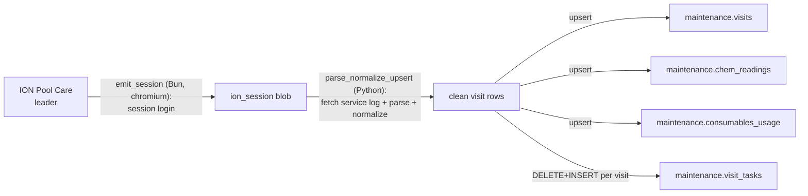

# Sync Flow: ION to maintenance.visits

> Status: [active]
> Kind: [sync]
> Verification: [verified] — traced against `f/ION/visits.flow/flow.yaml` on 2026-06-01
> Leader: ION Pool Care (visit records)
> Cache: [maintenance.visits](../../entities/visit.md) (+ chem_readings, consumables_usage, visit_tasks) — `[cache: ION + native]`

## What this keeps current

Mirrors ION's daily service-log visits into `maintenance.visits` and its per-visit detail tables. These visits are the operational record of what a tech actually did — and, per [monthly-maintenance-billing](../monthly-maintenance-billing/index.md), they are what ION bills from at month-end. Keeping this cache current is what makes the (proposed) visits-vs-invoice reconciliation possible.

## Trigger

- [schedule] background, like the other ION syncs (every few hours)
- Windmill flow `f/ION/visits.flow` — two steps
- `lookback_days` defaults to 7 (re-scrape the trailing week each run so late edits are caught)

## The sync

Two-step Windmill flow:
1. **`emit_session`** (Bun, chromium-tagged) — logs into ION via the shared session (`LOGIN_URL` / `USERNAME` / `PASSWORD` vars), emits a reusable `ion_session`.
2. **`parse_normalize_upsert`** (Python, path `f/ION/_discover/parse_normalize_test`) — fetches the service log for the lookback window, parses + normalizes via `_lib/parser.py` + `_lib/normalize.py`, upserts into the maintenance tables. `write_unmapped` defaults true (unmapped fields are still written for later mapping).

> Smell to clean up: the production parse step still lives under `f/ION/_discover/` (a discovery namespace). Per [ADR 002](../../adrs/002-ion-api-layer.md), this should become `f/ION/api/get_visits` + a thin upsert step.

## Anti-corruption transforms

Same shape as [ion-work-orders](ion-work-orders.md): column rename, currency/date coercion, empty-string-to-NULL. Visit tasks are normalized through the alias map in `_lib/normalize.py` (`TASK_ALIASES`, e.g. "Brsh" -> `brushed_pool`) and written to `maintenance.visit_tasks` via DELETE-then-INSERT per visit (so re-scraping a visit replaces its task set cleanly).

## Visit → task resolution (by service location)

The ION visit report carries **no task id**. `_lib/upsert.py` (`build_resolvers` / `resolve_task_and_schedule`) links a visit to a task by matching its **`service_location_id`** against existing `maintenance.tasks` rows, then picks a schedule slot by `day_of_week` + `actual_tech`. Two consequences:

- **No task row for the location -> `task_id` stays NULL.** The task table is a one-time 2026-04-26 import with no recurring sync, so customers onboarded since then have visits but no task (see [monthly-maintenance-billing](../monthly-maintenance-billing/index.md) prerequisite gap). A recurring ION -> `maintenance.tasks` / `task_schedules` sync is the missing piece.
- **Multi-task locations are mis-resolved.** `task_by_sl[service_location_id] = task_id` keeps only ONE task per location. Some locations legitimately have multiple active tasks (differentiated by price / start date / service type). The fix: disambiguate with a **combined best-match** (active date window + `day_of_week` + `actual_tech` + `price_cents` vs schedule rate + service type), since no single signal suffices — price matches only 59% (40% of visits are flat-rate with no per-visit rate). Ambiguous cases flag for review. (~17% of resolved visits already get a `task_id` but no `task_schedule_id` from the day/tech slot miss.)

## Leadership

`maintenance.visits` is mixed-leadership (`[cache: ION + native]`):

| ION-owned (this sync writes) | Our domain / app-owned |
|---|---|
| visit occurrence, scheduled/actual tech, times, status, `visit_type`, `ion_work_order_id`, `price_cents`, `snapshot_frequency` | `task_schedule_id` link, `billing_method`, reconciliation indicators (proposed) |

Note `maintenance.tasks` / `task_schedules` are ALSO partly app-owned — the Next.js maintenance UI (`lib/entities/task/mutations.ts`) edits routes/schedules, while the ION sync seeds them. See [Task Schedule](../../entities/task-schedule.md).

## Drift detection

**None currently** — same accepted gap as [ion-work-orders](ion-work-orders.md). The `lookback_days=7` re-scrape is the de-facto reconciliation for recent edits; older changes aren't caught.

## Write-back to ION

**None today.** [ADR 002](../../adrs/002-ion-api-layer.md) proposes adding write endpoints (e.g., correct a visit) behind the ION API layer.

## Cross-references

- Entity: [Visit](../../entities/visit.md)
- Sibling sync: [ion-work-orders](ion-work-orders.md)
- Consumes (future): [ION API](../../integrations/ion.md), [ADR 002](../../adrs/002-ion-api-layer.md)
- Downstream: [monthly-maintenance-billing](../monthly-maintenance-billing/index.md)
