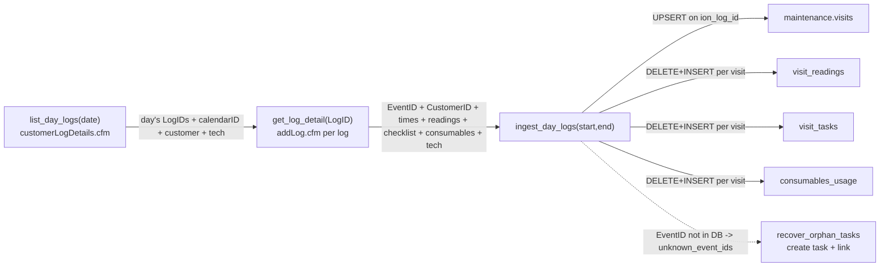

# Sync Flow: ION to maintenance.visits

> Status: [active]
> Kind: [sync]
> Verification: [verified] — per-log `ion_log_id` ingestion + EventID linker re-traced 2026-06-18;
> ADR 007 §9 re-trace 2026-06-22 (task→customer→location; bulk `CompletedLogDetail` confirmed retired)
> Leader: ION Pool Care (visit records)
> Cache: [maintenance.visits](../../entities/visit.md) (+ chem_readings, consumables_usage, visit_tasks) — `[cache: ION + native]`

## What this keeps current

Mirrors ION's daily service-log visits into `maintenance.visits` and its per-visit detail tables. These visits are the operational record of what a tech actually did — and, per [monthly-maintenance-billing](../monthly-maintenance-billing/index.md), they are what ION bills from at month-end. Keeping this cache current is what makes the (proposed) visits-vs-invoice reconciliation possible.

## The sync — log-detail ingestion (the real pipeline)

> The original bulk `CompletedLogDetail` report flow (`f/ION/visits.flow` →
> `_discover/parse_normalize_test`, `source='ion'`) is **superseded** — the report carries no
> unique visit id or task id, so it was replaced by per-log ingestion. **All 54,404 visits are
> `external_source='ion_log'`; zero `'ion'` rows exist.** The components below live in Windmill;
> several are not mirrored to the repo.

The grain is the **`LogID`** (one ION service log = one visit; dedup on `ion_log_id`):

- **`f/ION/api/list_day_logs`** — `customerLogDetails.cfm?dayindex=…` → every service log for a date (LogID, calendarID, customer, service, tech, status). The by-**day** list (not per-customer).
- **`f/ION/api/get_log_detail`** — `addLog.cfm?LogID=…` → the per-log record: **EventID (task) + CustomerID + TaskInvoiceID + times + serviceable + readings + checklist + consumables(named) + tech + comment + failure_reason**. This is where event_id + customer_id come from.
- **`f/ION/ingest_day_logs(start, end, dry_run, sess, sb)`** — orchestrates the two above per day, keeps performed logs (`event_id` + `time_in`), and **UPSERTs the visit on `ion_log_id`** (+ refreshes `visit_readings` / `visit_tasks` / `consumables_usage` by delete-then-insert). `submitted_by` falls back to the day-grid tech; `actual_tech_id` resolved inline from `employees.ion_username`. Links `task_id` from existing `task_schedules.ion_task_id` only — **does not create missing tasks** (reports `unknown_event_ids`), which is the orphan gap.
- **`f/ION/recover_orphan_tasks`** — creates the task + schedules for any `unknown_event_ids` and links the visits ([ion-visit-task-backfill](../../operations/ion-visit-task-backfill.md)). Folding this in after `ingest_day_logs` makes the daily flow **self-healing** (no orphans).

**Historical runners** (over `ingest_day_logs`, chunked, idempotent on `ion_log_id`):
`_run/backfill_visits_year` (the 54k re-run), `_run/fill_gap_visits`, `_run/ingest_may_v*`.

> **Pending:** wire `ingest_day_logs(window) → recover_orphan_tasks()` onto a daily schedule as the
> standard sync, and retire the dead `CompletedLogDetail` flow.

## Anti-corruption transforms

Same shape as [ion-work-orders](ion-work-orders.md): column rename, currency/date coercion, empty-string-to-NULL. Visit tasks are normalized through the alias map in `_lib/normalize.py` (`TASK_ALIASES`, e.g. "Brsh" -> `brushed_pool`) and written to `maintenance.visit_tasks` via DELETE-then-INSERT per visit (so re-scraping a visit replaces its task set cleanly).

## Visit → task → customer → location (EventID is the spine; ADR 007 §9)

A visit's identity and links all come from its ION **service log**, never from address matching:

- **task** — the log's **EventID** = `task_schedules.ion_task_id`. `ingest_day_logs` sets
  `visits.task_id` directly from it; `f/ION/link_visits_via_log.flow` is the recovery/override
  (`taskless_visits` → `resolve_visit_tasks_via_log`: loglist → LogID → **`addLog.cfm`** → the EventID →
  `link_visits_by_event`: set `visits.task_id` where `task_schedules.ion_task_id = EventID`). EventID is
  ground truth. See [task-record-linkage](../../operations/task-record-linkage.md).
- **customer** — the log's `CustomerID` (→ `Customers.ion_cust_id`), and equivalently `task.customer_id`
  (the authoritative per-task owner, ADR 006).
- **service_location** — derived from the **customer's** confirmed link-table locations
  (`public.reconcile_visit_locations`, [ADR 007 §9](../../adrs/007-address-resolution-and-customer-address-ledger.md)):
  one confirmed location → take it; several → fuzzy-match the visit's `raw_service_address` (pg_trgm).
  A task **no longer carries a `service_location_id`** (the column is being dropped) — the visit's
  location is the customer's confirmed address, not an independently-resolved one.

> **[retired]** The bulk `CompletedLogDetail` report **and its provisional by-`service_location_id` task
> match** — `f/ION/_lib/upsert.py` (`upsert_canonical` / `build_resolvers` / `resolve_task_and_schedule`,
> `tasks_by_sl`, `source='ion'`) — are dead (zero `'ion'` rows). **Do not treat `_lib/upsert.py` as the
> live visit ingester** (it survives only as a utility module — `_connect`, `normalize_*`). The old
> "Pass 1 provisional by service location" no longer exists; EventID is the only task link.

**The gap (`event_not_in_db`).** When a visit's EventID has **no task in our DB**, `task_id` stays NULL
until a **`get_task_detail` capture** primes the task (prime the customer from the log's `CustomerID` →
`get_task_detail(EventID)` → upsert the task + schedule → link the visits; `recover_orphan_tasks`). The
recurring ION → tasks/schedules sync (`_lib/upsert_tasks.py` / `upsert_schedules.py`) keeps it from
recurring. (Historic note: the 2026-04-26 one-time import skipped expired tasks, orphaning ~14.4k 2025
visits across 562 EventIDs.)

## Leadership

`maintenance.visits` is mixed-leadership (`[cache: ION + native]`):

| ION-owned (this sync writes) | Our domain / app-owned |
|---|---|
| visit occurrence, scheduled/actual tech, times, status, `visit_type`, `ion_work_order_id`, `price_cents`, `snapshot_frequency` | `task_schedule_id` link, `billing_method`, reconciliation indicators (proposed) |

Note `maintenance.tasks` / `task_schedules` are ALSO partly app-owned — the Next.js maintenance UI (`lib/entities/task/mutations.ts`) edits routes/schedules, while the ION sync seeds them. See [Task Schedule](../../entities/task-schedule.md).

## Drift detection

**None currently** — same accepted gap as [ion-work-orders](ion-work-orders.md). The `lookback_days=7` re-scrape is the de-facto reconciliation for recent edits; older changes aren't caught.

## Write-back to ION

**None today.** [ADR 002](../../adrs/002-ion-api-layer.md) proposes adding write endpoints (e.g., correct a visit) behind the ION API layer.

## Cross-references

- **Endpoint field reference (exact shapes from `addLog` / `addTask`):**
  [ion-task-and-log-detail](../../integrations/ion-task-and-log-detail.md)
- **Historical backfill + the linker flows (the undocumented 33k re-run):**
  [ion-visit-task-backfill](../../operations/ion-visit-task-backfill.md)
- Entity: [Visit](../../entities/visit.md)
- Sibling sync: [ion-work-orders](ion-work-orders.md)
- Consumes (future): [ION API](../../integrations/ion.md), [ADR 002](../../adrs/002-ion-api-layer.md)
- Downstream: [monthly-maintenance-billing](../monthly-maintenance-billing/index.md)
