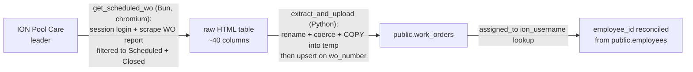

# Sync Flow: ION to work_orders

> Status: [active]
> Kind: [sync]
> Verification: [verified] — traced against `f/ION/work_orders.flow` on 2026-05-28
> Leader: ION Pool Care (work order records)
> Cache: [public.work_orders](../../entities/work-order.md) — `[cache: ION + native]`

## What this keeps current

Mirrors ION work orders into `public.work_orders`. This is a foundational sync flow — many downstream flows depend on it, including [work-order-to-payment](../work-order-to-payment.md). It runs in the background on a schedule; downstream flows assume `public.work_orders` is current because this flow keeps it so.

## Trigger

- [schedule] `f/ION/work_orders` — every 4 hours (cron `0 0 */4 * * *` ET)
- Windmill flow `f/ION/work_orders` (two steps below)

## The sync

Two-step Windmill flow:

1. **`get_scheduled_wo`** (Bun, chromium-tagged) — logs into ION via the shared session, scrapes the work-order report filtered to `Scheduled` + `Closed` statuses, writes raw HTML table to a file.
2. **`extract_and_upload`** (Python) — parses the table, applies anti-corruption transforms (below), COPYs into a temp table, then upserts into `public.work_orders` keyed on `wo_number`.

## Anti-corruption transforms (ION → our schema)

This is where ION's messy reality gets cleaned into our schema. Per [ADR 001](../../adrs/001-platform-architecture.md), this step IS the anti-corruption layer.

| Transform | Why |
|---|---|
| Column rename (`WO #` -> `wo_number`, `Sub Total` -> `sub_total`, `Invoice #` -> `invoice_number`, ~40 columns) | ION's display headers -> our snake_case schema |
| Currency parse (`$1,234.56` -> `1234.56`) on `approved_limit`, `sub_total`, `tax_total`, `total_due` | ION returns formatted strings |
| Date coercion (`pd.to_datetime(errors='coerce')`) on install_date, created, scheduled, started, completed, last_sent | **Critical**: ION's HTML occasionally puts garbage (part numbers, serial fragments) in date columns. Without coercion, ONE bad row aborts the entire COPY, rolling back ALL upserts. This silently broke 2024 WO sync for an unknown period. Bad values are coerced to NULL and logged with wo_number + customer + raw value for cleanup in ION. |
| Empty string -> NULL | ION uses `''` where we want NULL |

## Leadership: which columns ION owns vs which are ours

`public.work_orders` is a mixed-leadership table (per-column, per [ADR 001](../../adrs/001-platform-architecture.md)):

| ION-owned (this sync writes these) | Our domain (this sync NEVER touches) |
|---|---|
| `wo_number`, `type`, `template`, `wo_status`, `customer`, `address`, `sub_total`, `tax_total`, `total_due`, `invoice_number`, `approval_status`, `schedule_status`, `completed`, `scheduled`, `created`, `assigned_to`, ~25 more | `billing_status`, `billing_status_set_at`, `needs_review_reason` (owned by service-billing) |
| `billable` — **GENERATED column**, computed by Postgres from `billable_override` + `schedule_status` | `billable_override` (our manual override input to the generated column) |
| `employee_id` — reconciled from `assigned_to` via `ion_username` lookup against `public.employees` | |

How our columns are preserved: the sync's pandas DataFrame only contains ION columns (from the rename map). `update_cols` is every DataFrame column except `wo_number`. Since `billing_status` is not in the DataFrame, the upsert's ON CONFLICT never updates it. **Per-column leadership is preserved by omission** — the sync literally doesn't know our columns exist.

## Drift detection

**None currently.** Unlike the QBO caches (which have the [CDC reconciler](qbo-drift-reconciliation.md)), the work_orders cache is fire-and-forget from ION every 4h. A WO deleted or changed in ION between syncs isn't caught until the next scrape. This is an accepted gap — ION doesn't offer a change feed, and the 4h full re-scrape is the de-facto reconciliation.

## Write-back to ION

**None.** ION is read-only for us today. We never write work-order changes back to ION.

## Failure modes

| Failure | Effect | Handling |
|---|---|---|
| One row has garbage in a date column | Previously: entire sync aborts, all WOs roll back (silent) | Now: date coercion to NULL + verbose logging; sync proceeds |
| ION session login fails | Flow fails | Raises (not silent) so Windmill marks job failed + alerts fire |
| ION drops rows from the report | Those WOs go stale until they reappear | No detection — known gap (see Drift detection) |

## Open questions / future

- **No drift detection** — consider a lightweight reconciliation or accept the 4h-scrape-as-reconciliation model.
- **Future ION API layer**: Carter plans to build a session-based-login API over ION with a library of collected endpoints, so flows call a clean internal API instead of scraping HTML. That API would be a shared anti-corruption layer OUTSIDE any single flow — this sync flow would just call it. Out of scope for now; tracked here so future sessions know the intent.

## Cross-references

- Entity kept current: [Work Order](../../entities/work-order.md)
- Downstream flows that depend on this: [work-order-to-payment](../work-order-to-payment.md)
- Architecture: [ADR 001](../../adrs/001-platform-architecture.md)
- Source: [f/ION/work_orders.flow](../../../f/ION/work_orders.flow/flow.yaml)
