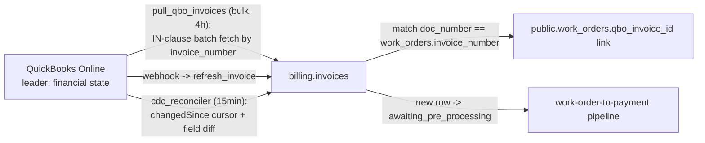

# Sync Flow: QBO to billing.invoices

> Status: [active]
> Kind: [sync]
> Verification: [verified] — traced against `f/service_billing/pull_qbo_invoices.py` + cdc_reconciler on 2026-05-28
> Leader: QuickBooks Online (invoice financial state)
> Cache: [billing.invoices](../../entities/invoice.md) — `[cache: QBO + native]`

## What this keeps current

Mirrors QBO invoices into `billing.invoices` and reflects QBO's financial-state changes (balance, email status, payments applied) back into our cache. This is the inbound boundary of [work-order-to-payment](../work-order-to-payment/index.md): a freshly-cached invoice seeds `awaiting_pre_processing` and the pipeline takes over.

Note the invoice's split leadership (see [Invoice](../../entities/invoice.md)): ION creates the invoice + number, then QBO becomes the leader for financial state. This sync only deals with the QBO half. The ION-to-QBO hand-off is the manual queue push described in [work-order-to-payment](../work-order-to-payment/index.md).

## Trigger

- [schedule] every 4h — bulk pull of stale/missing invoices via [pull_qbo_invoices](../../scripts/service_billing/pull_qbo_invoices.md)
- [manual] single-WO "Sync from QBO" button — same script, `wo_number` arg
- [webhook] QBO invoice webhooks — low-latency reflections of balance / email-status changes
- [schedule] every 15min — [cdc_reconciler](../../scripts/service_billing/cdc_reconciler.md) backstop for dropped webhooks ([qbo-drift-reconciliation](qbo-drift-reconciliation.md))

## The sync

## Matching to the work order

The cache row is matched to its WO by `work_orders.invoice_number == billing.invoices.doc_number`. The resulting link, `work_orders.qbo_invoice_id`, is **our domain data** — it exists in neither ION nor QBO. See [ADR 001](../../adrs/001-platform-architecture.md).

## Reflecting our writes back

When [process_work_order](../../scripts/service_billing/process_work_order.md) charges a card and records a QBO Payment, QBO's invoice balance drops to 0 and email status flips to `EmailSent`. That change reflects back through this sync (webhook, or cdc_reconciler if the webhook dropped), and `trg_auto_promote_to_processed` flips the cached invoice to `processed`. This is the `[reflection]` edge that closes the charge `[write-out]`.

## Drift detection

Yes — unlike the ION sync, the QBO caches have the [CDC reconciler](qbo-drift-reconciliation.md) as a 15-minute backstop. The drift window is: charge recorded in QBO -> webhook dropped -> up to 15min until the reconciler catches it. Critical drift (`cache_ahead`: our cache newer than QBO) halts and alerts.

## Failure modes

| Failure | Effect | Handling |
|---|---|---|
| QBO token refresh fails | Pull aborts | Raises; Windmill marks job failed |
| Webhook dropped | Invoice stays stale (balance/email not reflected) | cdc_reconciler catches within 15min |
| Line items lost in ION-to-QBO push | QBO subtotal < WO subtotal | `subtotal_ok` indicator flips false -> `needs_review` (see [work-order-to-payment](../work-order-to-payment/index.md)) |

## Cross-references

- Entity kept current: [Invoice](../../entities/invoice.md)
- Scripts: [pull_qbo_invoices](../../scripts/service_billing/pull_qbo_invoices.md), [cdc_reconciler](../../scripts/service_billing/cdc_reconciler.md)
- Drift backstop: [qbo-drift-reconciliation](qbo-drift-reconciliation.md)
- Downstream: [work-order-to-payment](../work-order-to-payment/index.md)
- Architecture: [ADR 001](../../adrs/001-platform-architecture.md)
