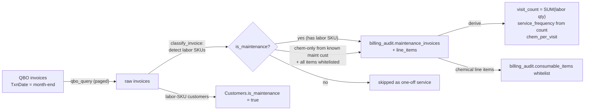

# Sync Flow: QBO to billing_audit.maintenance_invoices

> Status: [active]
> Kind: [sync]
> Verification: [verified] — traced against `f/billing_audit/load_month.py` on 2026-06-01
> Leader: QuickBooks Online (invoice financial state); ION (invoice creation, upstream)
> Cache: [billing_audit.maintenance_invoices](../../entities/maintenance-invoice.md) (+ line_items) — `[cache: QBO + native]`

## What this keeps current

At month-end, pulls the month's QBO invoices, identifies which are maintenance (vs one-off service), and caches them into `billing_audit.maintenance_invoices` + `maintenance_invoice_line_items`. This is the billing-side mirror that feeds the autopay run in [monthly-maintenance-billing](../monthly-maintenance-billing.md).

Distinct from the per-WO [qbo-invoices sync](qbo-invoices.md): that one pulls a single WO's invoice on demand; this one bulk-pulls a whole month and classifies + derives billing analytics.

## Trigger

- [manual] / [schedule] month-end — [load_month](../../scripts/billing_audit/load_month.md) with `billing_month=YYYY-MM`
- Idempotent: early-returns if that month already loaded
- Pulls QBO invoices `WHERE TxnDate = <last day of billing_month>`

## The sync

## Classification (the anti-corruption logic)

`classify_invoice` reads each invoice's line items and:
- Matches item names against `LABOR_KEYWORDS` (POOL MAINTENANCE -> PM, FLAT RATE -> FR, CHEMICAL TESTING -> CT, SPA CLEAN, FOUNTAIN CLEAN, QUALITY CONTROL, GREEN POOL, HALF HOUR, ONE TIME CLEAN).
- **`visit_count`** = SUM of quantities across countable labor lines (excludes discounts; FR/flat-rate gets no count).
- **`service_frequency`** derived from visit_count: `<=1.5 monthly`, `<=3.5 biweekly`, `<=7 weekly`, `<=10.5 2x_weekly`, else `high_freq` (or `flat_rate`/`one_time`/`green_pool` by service type).
- Non-labor lines classified as chemical / fee / adjustment / other.
- **Rescue rule**: a chem-only invoice (no labor SKU) from a known-maintenance customer is included IF every line item is in the `consumable_items` whitelist (service_type `CHEM_ONLY`).

Side effects: auto-flags `Customers.is_maintenance=true` for labor-SKU customers, and grows the `consumable_items` whitelist from confirmed maintenance invoices.

## Reflecting balance changes

During the autopay run, `sync_invoice_balances` re-pulls live QBO balances into `maintenance_invoices.balance_due` (a `[reflection]` from QBO). **Note:** unlike `billing.invoices`, this `billing_audit` cache is NOT covered by the [CDC reconciler](qbo-drift-reconciliation.md) (which refreshes `billing.invoices` / `customer_payments` / `Customers` only). The explicit `sync_invoice_balances` poll is the sole reflection path for maintenance-invoice balances — there's no 15-minute CDC backstop here (open gap).

## Failure modes

| Failure | Effect | Handling |
|---|---|---|
| Month already loaded | no-op | idempotency check returns `already_loaded` |
| No invoices for the month | no-op | returns `no_invoices` |
| A maintenance invoice lacks a labor SKU and isn't whitelisted | excluded from billing | logged in `rescue_skipped` for review |

## Cross-references

- Entity: [Maintenance Invoice](../../entities/maintenance-invoice.md)
- Script: [load_month](../../scripts/billing_audit/load_month.md), [compute_chemical_estimates](../../scripts/billing_audit/compute_chemical_estimates.md)
- Downstream: [monthly-maintenance-billing](../monthly-maintenance-billing.md)
- Sibling: [qbo-invoices](qbo-invoices.md)
