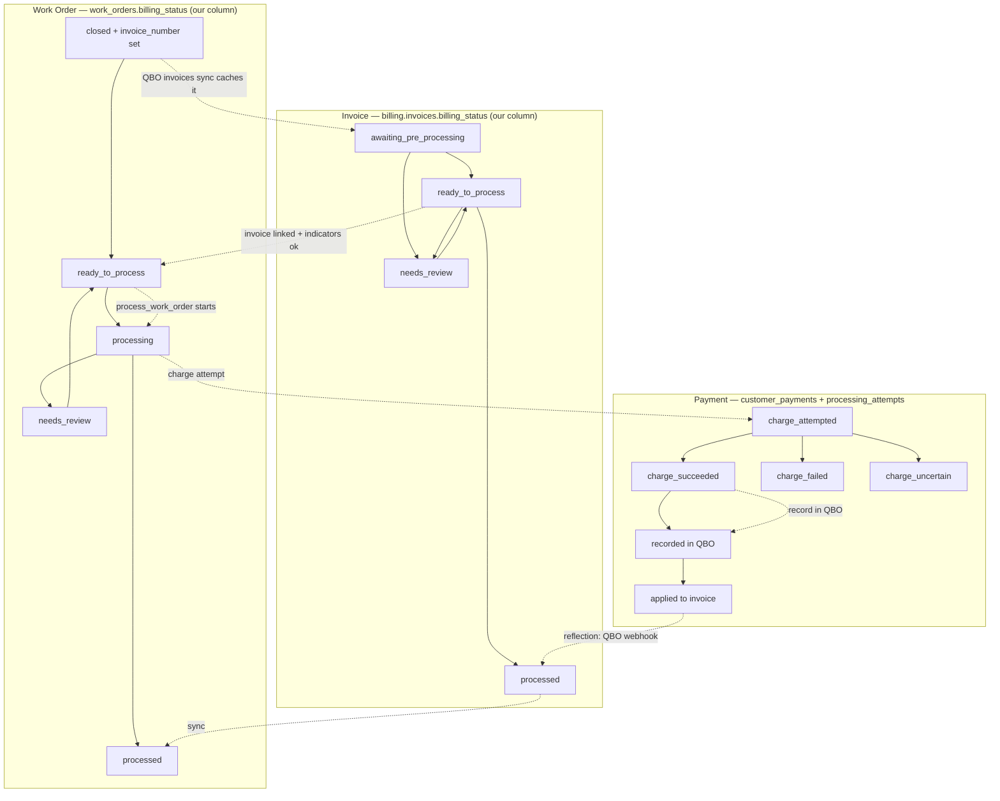

# Flow: Work Order to Payment

> Status: [active]
> Kind: [orchestration]
> Verification: [verified] — invoice-origin + subtotal-check confirmed with Carter 2026-05-28; code-level audit of each edge still pending
> Domain: service-billing
> Entities: [Work Order](../entities/work-order.md), [Invoice](../entities/invoice.md), [Payment](../entities/payment.md)

## The crux

A closed service work order goes from "closed in ION" to "paid + receipt emailed + recorded in QBO". Three entities (Work Order, Invoice, Payment) each run their own state machine; this flow is the coordination between them, plus the writes back to the external leaders.

## Where the invoice actually comes from (important)

The invoice does NOT originate in QBO. It originates in **ION**:

1. Work order is **closed in ION**.
2. **ION creates the invoice and assigns the `invoice_number`** — ION is the leader for invoice creation + line items.
3. The invoice enters an **ION-to-QBO syncing queue**.
4. Someone **manually pushes the queue through**.
5. The invoice appears in **QBO with the same invoice_number** — now QBO is the leader for the invoice's financial state (balance, email_status, payments applied).
6. Our [QBO invoices sync](sync/qbo-invoices.md) caches it into `billing.invoices`, matched to the WO by `work_orders.invoice_number == billing.invoices.doc_number`.

So the invoice has **two leaders at different stages**: ION (creation, line items, number) then QBO (financial state). The `subtotal_ok` indicator exists to verify the **ION-to-QBO sync didn't lose line items** — see below.

## Preconditions (maintained by sync flows, not this flow)

- A closed, billable WO exists in our cache with `invoice_number` set — kept current by [ION work-orders sync](sync/ion-work-orders.md). (`billable` is a generated column; the invoice_number is ION's, synced over.)
- The corresponding invoice is cached from QBO — kept current by [QBO invoices sync](sync/qbo-invoices.md).
- The customer's payment methods are cached — kept current by [QBO payment-methods sync](sync/qbo-payment-methods.md), itself kicked off when a new invoice lands.

## The three state machines

## Transitions + edge types (table fallback)

Per [ADR 001](../adrs/001-platform-architecture.md): `[internal]` = our state; `[write-out]` = we push to a leader; `[reflection]` = leader change flows back via a sync flow.

| When | Entity -> state | Edge type | Driven by |
|---|---|---|---|
| Office closes WO in ION; ION creates invoice + number; ION-to-QBO queue pushed; [QBO invoices sync](sync/qbo-invoices.md) caches it | `INV`: (none) -> `awaiting_pre_processing` | [reflection <- QBO] | [pull_qbo_invoices](../scripts/service_billing/pull_qbo_invoices.md) |
| `pre_process_invoice` writes memo/PM/class, sets `enrichment_ok`; all indicators true | `INV`: `awaiting_pre_processing` -> `ready_to_process` | [internal] | [pre_process_invoice](../scripts/service_billing/pre_process_invoice.md) |
| `subtotal_ok` check fails (WO sub_total != invoice subtotal -> line items lost in ION-to-QBO sync) | `INV`: -> `needs_review` (reason: subtotal mismatch) | [internal] | indicator trigger on `billing.invoices` |
| Invoice reaches `ready_to_process` AND linked to WO | `WO`: -> `ready_to_process` | [internal] | trigger on `public.work_orders` |
| Human clicks Charge (or auto-processor) | `WO`: `ready_to_process` -> `processing` | [internal] | [process_work_order](../scripts/service_billing/process_work_order.md) acquires lock |
| Charge card via Intuit Payments | `PAY`: -> `charge_attempted` -> `charge_succeeded` | [write-out -> Intuit Payments] | [process_work_order](../scripts/service_billing/process_work_order.md) |
| Intuit times out / 5xx | `PAY`: -> `charge_uncertain` | [write-out -> Intuit Payments] (no reflection yet) | resolved by [reconcile_payments](../scripts/service_billing/reconcile_payments.md) |
| Record QBO Payment (CCTransId) | `PAY`: -> `recorded in QBO` | [write-out -> QBO] | [process_work_order](../scripts/service_billing/process_work_order.md) |
| QBO webhook: balance=0, EmailSent | `INV`: `ready_to_process` -> `processed` | [reflection <- QBO, via [qbo-invoices sync](sync/qbo-invoices.md)] | `trg_auto_promote_to_processed` |
| Invoice -> `processed` | `WO`: `processing` -> `processed` | [internal] | [process_work_order](../scripts/service_billing/process_work_order.md) final step |

## Why subtotal_ok matters

The ION-to-QBO invoice sync (step 4 above, the manual queue push) can **drop line items**. When that happens, the QBO invoice's subtotal is less than the WO's subtotal. `subtotal_ok` compares the WO `sub_total` (ION's view, in our cache) against the invoice subtotal (QBO's view, in our cache). A mismatch means line items were lost in the ION-to-QBO sync, and the invoice is held at `needs_review` rather than charged. This is a **drift check between two external systems**, using our cache as the comparison point — invisible from the code without this context.

## Bounded contexts crossed

| Boundary | What's on the other side | Interaction |
|---|---|---|
| **ION** | Owns the WO record + invoice creation + line items + invoice_number. | Read-only mirror via [ion-work-orders sync](sync/ion-work-orders.md). We never write to ION. |
| **QBO** | Owns invoice financial state + payment records. | Bidirectional: mirror via [qbo-invoices sync](sync/qbo-invoices.md); push charges/payments back (write-out edges). |
| **Intuit Payments** | Processes the actual charge. | Write-out only; result reflected via QBO Payment + `reconcile_payments`. |
| **Customer** | Receives receipt email. | Outbound via Gmail. |

## Backstops (recovery paths)

Every `[write-out]` -> `[reflection]` edge has a drift window. Three scheduled scripts catch what slips through:

- [dispatch_pre_processing](../scripts/service_billing/dispatch_pre_processing.md) — every 60s, re-fires pre_process if the pg_net trigger dropped
- [reconcile_payments](../scripts/service_billing/reconcile_payments.md) — every 5min, resolves `charge_uncertain` by polling QBO to verify whether the charge landed
- [cdc_reconciler](../scripts/service_billing/cdc_reconciler.md) — every 15min, catches missing QBO webhooks via the CDC endpoint and replays state changes ([qbo-drift-reconciliation sync](sync/qbo-drift-reconciliation.md))

## Cross-references

- Sync flows this depends on: [ion-work-orders](sync/ion-work-orders.md), [qbo-invoices](sync/qbo-invoices.md), [qbo-payment-methods](sync/qbo-payment-methods.md), [qbo-drift-reconciliation](sync/qbo-drift-reconciliation.md)
- Entities: [Work Order](../entities/work-order.md), [Invoice](../entities/invoice.md), [Payment](../entities/payment.md)
- Architecture: [ADR 001](../adrs/001-platform-architecture.md)
